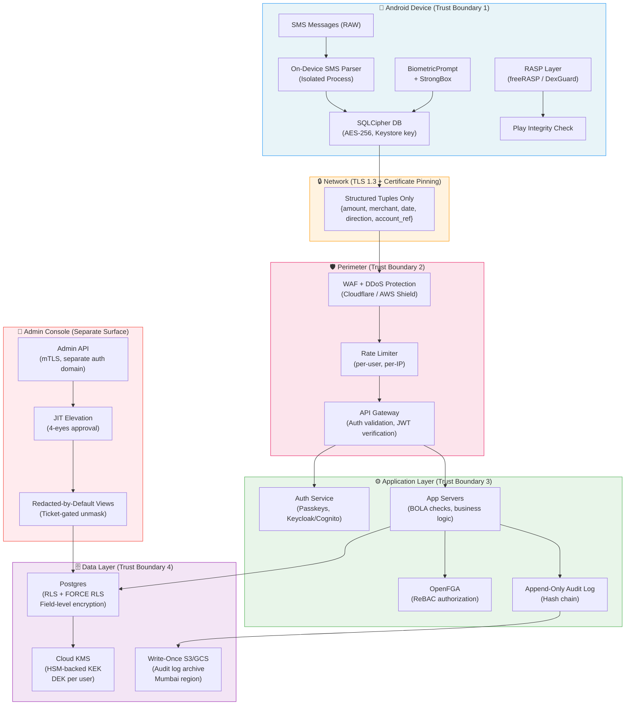

# 02 — Security Architecture
**PenniLogic Personal Finance App**
*Authored by: Research Agent · Last updated: 2026-09-01*

> **Scope**: Native Android (Kotlin/Compose) + Web App + Admin Console + Backend (Postgres).
> Launch market: India. Global expansion planned.
> Data handled: bank transactions, salary, debts, on-device-parsed SMS.
>
> **Execution-gate warning:** this is research input, not an implementation contract. Encryption and
> searchable-field scope are fixed by `T-ADR-CRYPTO-04`; authentication, recovery and workload
> identity by `T-ADR-AUTH-05`; the administrative boundary by `T-ADR-ADMIN-06`; and shared-data
> erasure by `T-ADR-ERASE-07`. Downstream tickets must consume the accepted records rather than copy
> an illustrative choice from this document.

## Who owns what in this document

This table exists so a research-era deferral in the text below is never mistaken for implementation
authority. Every row names the item that actually decides the topic. Where this document says
"deferred", "TBD", "to be decided" or offers two options, the owning item is the authority - not the
paragraph. Where this document states a number, that number is illustrative unless the owning item
has adopted it.

| Topic in this document | Decided by | Implemented by | This document is |
|---|---|---|---|
| Encryption scope, blind index, row-level security, grant-mediated cross-user reads | `T-ADR-CRYPTO-04` (ADR-018) | `T-SEC-01` | Research input |
| Key rotation, retirement, emergency rotation | `T-ADR-CRYPTO-04` (ADR-018) | `T-SEC-06` | Research input |
| Shared-data erasure and cross-user key access | `T-ADR-ERASE-07` (ADR-021) | `T-SEC-02` | Research input |
| Authentication provider, passkeys, relying-party identifier | `T-ADR-AUTH-05` (ADR-019) | `api#4`, `api#5`, `T-SEC-04`, `T-SEC-05` | Research input |
| Account recovery, cooling-off, session revocation | `T-ADR-AUTH-05` (ADR-019) | `T-AUTH-01`, `T-AUTH-02` | Research input |
| Administrative boundary, database role, audit streams | `T-ADR-ADMIN-06` (ADR-020) | `T-ADM-01` to `T-ADM-06` | Research input |
| Administrator joiner, mover, leaver and recertification | `T-ADR-ADMIN-06` (ADR-020) | `T-ADM-06` | Silent; this document does not cover it |
| Sharing grants, revocation bounds, access transparency | `T-ADR-CRYPTO-04`, `T-CON-04` | `T-FAM-01`, `T-FAM-02`, `T-TRU-04` | Research input |
| Offline lease TTL and remote-wipe signal (the 24-hour figure below) | `T-CON-04` publishes both revocation bounds | `T-FAM-02` tests them | Illustrative number only |
| AI egress, runtime platform, custom destinations | `T-ADR-AIEGRESS-08` (ADR-022) | `T-AI-01`, `T-AI-02` | Research input |
| Threat model contents and refresh cadence | `T-QA-14` | `T-QA-14`, enforced by `T-GOV-04` | Starting point, now superseded by the refreshed model |
| Penetration test and red-team scope | `T-QA-10` | `T-QA-10` | Not covered |
| Statutory values: reporting windows, retention periods, thresholds | Counsel-reviewed jurisdiction profile, owned by `T-CMP-04` | `T-CMP-01`, `T-BIL-04` | Not authoritative; never cite a number from here as a legal position |

**Two bounds, not one.** Where this document says revocation is "instant" and elsewhere specifies a
24-hour local cache TTL, both are true of different things: the online bound applies to
server-served reads, the offline lease bound applies to a client that cannot reach the server. Both
are published as numeric contract metadata by `T-CON-04` and tested by `T-FAM-02`, and neither is
described to a user as immediate. See
[`01-domain-model.md` §3](01-domain-model.md#3-ownership-sharing-and-authorization).

---

## Table of Contents
1. [Established Constraints](#0-established-constraints)
2. [Threat Model (STRIDE)](#1-threat-model-stride)
3. [Admin Console Insider-Risk Design](#2-admin-console-insider-risk-design)
4. [Family / Shared-Group Authorization](#3-family--shared-group-authorization)
5. [Cryptography & Key Management](#4-cryptography--key-management)
6. [Android Hardening](#5-android-hardening)
7. [Backend & Infrastructure Security](#6-backend--infrastructure-security)
8. [Authentication](#7-authentication)
9. [Privacy Engineering](#8-privacy-engineering)
10. [Real Breaches & Lessons](#9-real-breaches--lessons)
11. [Defense-in-Depth Diagram](#10-defense-in-depth-diagram)
12. [Security Requirements Checklist](#11-security-requirements-checklist)
13. [Sources](#12-sources)

---

## 0. Established Constraints

| # | Constraint | Design Impact |
|---|------------|---------------|
| C-1 | Google Play grants `READ_SMS` under the "SMS-based money management" exception ([Google Play policy](https://support.google.com/googleplay/android-developer/answer/10208820)). Call log access is **NOT** permitted. | SMS permission is granted; limit its use strictly to transaction parsing. |
| C-2 | **Raw SMS/email content NEVER leaves the device.** Only structured `{amount, merchant, date, direction, account_ref}` tuples are transmitted. | All parsing logic lives on-device (Android service). Server never sees raw PII strings. |
| C-3 | Money is stored as **integer minor units** (paise, cents). | No floating-point ambiguity; no rounding errors in ledger. |
| C-4 | The ledger is **double-entry and append-only**. | Deletion = crypto-shredding of per-user data encryption key (see §4). |

---

## 1. Threat Model (STRIDE)

### 1.1 Assets

| Asset | Sensitivity | Notes |
|-------|-------------|-------|
| Raw SMS messages | **Critical** | Never leaves device — on-device parse only |
| Structured transactions `{amount, merchant, date, direction, account_ref}` | High | Transmitted to backend over TLS |
| Salary & debt figures | High | Highest financial PII |
| User identity (name, phone, email) | High | Linked to financial profile |
| Auth tokens (access + refresh) | High | Can impersonate user |
| Aggregate analytics / ML model inputs | Medium | Can leak patterns even if values redacted |
| Admin credentials | **Critical** | Wide blast radius |
| Encryption keys (DEKs, KEKs) | **Critical** | Compromise = full data exposure |
| Append-only ledger rows | High | Integrity guarantee must be maintained |
| Audit logs | High | Tamper = insider cover-up |

### 1.2 Trust Boundaries

```
[Android Device]──TLS 1.3──▶[API Gateway]──▶[App Servers]──▶[Postgres + KMS]
       │                          │                               │
  Keystore/StrongBox         WAF + Rate Limiter           RLS + Encrypted columns
  (hardware boundary)        (perimeter boundary)         (data boundary)

[Admin Console]──mTLS──▶[Admin API] (separate surface, separate auth)
[CI/CD Pipeline]──OIDC──▶[Cloud APIs] (no long-lived secrets)
```

### 1.3 Threat Actors

| Actor | Capability | Primary Goal |
|-------|-----------|--------------|
| Opportunistic attacker | Low-medium; uses known CVEs, credential stuffing | Bulk account access, sell data |
| Malicious insider / admin | High; has production access | Exfiltrate user financial data, cover tracks |
| Malicious family-group member | Low; has in-app shared access | Stalk partner finances, intimate partner abuse |
| Compromised device | Medium; root/malware | Extract local DB, intercept keystrokes |
| Hostile app on same device | Medium; overlay attacks, clipboard sniffing | Capture transaction amounts, intercept OTPs |
| Supply chain attacker | High; targets build pipeline / dependencies | Inject backdoor into app or backend |

### 1.4 STRIDE Threat Table

| ID | Component | Threat Category | Threat Description | Mitigation |
|----|-----------|----------------|--------------------|------------|
| T-01 | API Gateway | **S**poofing | Credential stuffing — attacker uses leaked username/password combos | Passkeys (primary), rate-limit login, device fingerprint, step-up for new device |
| T-02 | Refresh Token Store | **T**ampering | Stolen refresh token replayed after rotation | Refresh token rotation + reuse detection; family invalidation on reuse |
| T-03 | Structured transaction upload | **R**epudiation | User denies authorizing upload; admin denies viewing record | Append-only audit log with HMAC chaining; per-action justification fields |
| T-04 | Postgres RLS | **I**nformation disclosure | App connects as DB superuser → RLS bypassed silently | Enforce `FORCE ROW LEVEL SECURITY`; app connects as low-privilege role only |
| T-05 | Admin Console | **I**nformation disclosure | Admin reads any user's salary/debt without business reason | Redacted-by-default views; JIT elevation requires support ticket ID; dual approval for bulk export |
| T-06 | Family sharing | **I**nformation disclosure | Partner A sees partner B's salary after relationship ends | ReBAC revocation; access transparency log shown to data subject; safe-exit flow |
| T-07 | Android local DB | **I**nformation disclosure | Device stolen / ADB backup | SQLCipher with Keystore-backed key; `allowBackup=false`; FLAG_SECURE on all Activities |
| T-08 | SMS Parser | **I**nformation disclosure | Hostile app reads parsed output via IPC | Parser runs in isolated process; results communicated only via internal Room write; no exported components |
| T-09 | Third-party LLM integration | **I**nformation disclosure | Raw transaction text sent to OpenAI/Gemini | Strip PII before sending: replace merchant names with category codes, mask amounts above threshold; contractual DPA |
| T-10 | Build pipeline | **T**ampering | Malicious dependency injected via npm/Gradle supply chain | SLSA Level 3 build provenance; Sigstore artifact signing; Dependabot + Snyk; dependency pinning by SHA |
| T-11 | Cloud KMS | **E**levation of privilege | Compromised cloud account accesses master keys | Customer-managed keys (CMEK); HSM-backed key storage; key access logged and alerted; MFA on cloud console |
| T-12 | Append-only ledger | **T**ampering | Admin edits historical transaction | Ledger is INSERT-only; no UPDATE/DELETE grants to app role; hash chain integrity checks in nightly job |
| T-13 | Auth tokens | **D**enial of service | Token flood exhausts token store | Stateless JWT with short TTL (15 min access); refresh tokens stored as hashed values only |
| T-14 | Overlay / tapjacking | **T**ampering | Hostile app draws over PenniLogic's PIN entry | `setFilterTouchesWhenObscured(true)` on all sensitive views; Android 12+ touch-blocking enforced |
| T-15 | Clipboard | **I**nformation disclosure | Sensitive amounts/account numbers copied to clipboard persist | Clear clipboard after 30 seconds; use `ClipDescription` to mark data as sensitive (Android 13+) |

---

## 2. Admin Console Insider-Risk Design

### 2.1 The Problem

An admin who can "control the full application" over financial data is among the highest-risk surfaces in the entire system. Industry references (Stripe, bank internal tooling) treat internal admin tools as **risk systems**, not productivity tools — every action must be attributable, controlled, and reversible.
- Source: [Fintech Internal Tools Are Risk Systems](https://www.atlasfin.com/post/fintech-internal-tools-security)

### 2.2 Concrete Design

#### Principle 1: Redacted-by-Default Views
- Financial fields (`salary`, `debt_balance`, `transaction_amount`, `account_ref`) are masked as `****` in the default admin list views.
- An admin must explicitly click "Request Access" — triggering an **access justification** step — to unmask a record.
- Justification must reference an open support ticket ID. The system validates the ticket exists in the support platform (Zendesk/Linear) via API call.

#### Principle 2: Just-in-Time (JIT) Elevation
- Admins have a **base role** with read-only access to non-PII metadata (user ID, account status, creation date) during normal hours.
- Elevation to `pii_viewer` or `transaction_viewer` is **time-boxed** (max 4 hours) and expires automatically.
- Elevation requests go through a lightweight approval queue (Slack bot or in-console UI) where a second admin must approve.
- Reference: [Four Eyes Principle](https://www.42gears.com/blog/what-is-four-eyes-principle-mdm/), [Dan Stoll — Dual Control Workflow Patterns](https://danstoll.io/patterns/four-eyes-dual-control)

#### Principle 3: Break-Glass Access
- A single `break_glass_admin` credential exists in a physical vault (or HSM-backed secret with physical key ceremony) for true emergencies (data center outage, legal hold).
- Use requires two senior engineers physically co-present (or via video + separate OTP).
- All break-glass sessions are fully recorded.
- Account is **disabled immediately** after the session ends and re-keyed.
- Reference: [OCI Break-Glass Pattern](https://www.ateam-oracle.com/oci-break-glass)

#### Principle 4: Immutable Audit Log
- Every admin action (view, unmask, export, edit account status) writes to an append-only audit table.
- Audit rows include: `admin_id`, `action_type`, `target_user_id`, `ticket_ref`, `timestamp`, `ip_address`, `session_id`, `sha256_of_row_n_minus_1` (hash chain).
- Log is streamed to a separate, write-only S3/GCS bucket (admin console has no delete permission).
- Retention: **180 days minimum** (CERT-In 2022 requirement), 7 years for financial records.
- Source: [CERT-In 180-day log retention](https://www.secure60.io/compliance/cert-in-180-day-log-retention/)

#### Principle 5: Insider Risk Behavioral Monitoring
- Anomaly detection flags:
  - Admin views > 50 user records in a session (bulk data scrape pattern)
  - Admin views records outside their support queue scope
  - Access from unusual IP / geo / time-of-day
- Alerts page the security team in real time.
- Source: [Insider Risk Management (Strac)](https://www.strac.io/blog/insider-risk-management)

#### Principle 6: Separation of Duties
- No single admin can both approve their own JIT elevation and use the elevated access.
- Production database credentials are never surfaced in the admin console UI.
- Bulk data exports require a formal data access request approved by the CISO and DPO.

#### 2.3 Admin Console Tech Stack Recommendation
```
Admin Console → Admin API (separate service, separate auth domain)
                    │
                    ├─ AuthZ: OPA / Cedar policy engine checking role + ticket_ref
                    ├─ Audit writer: append-only Postgres table + stream to S3
                    └─ KMS: admin actions never receive raw DEKs; server decrypts and returns redacted view
```

---

## 3. Family / Shared-Group Authorization

### 3.1 The Intimate Partner Abuse Problem

Shared finance apps create a surveillance vector: a financially controlling partner can monitor spending, flag purchases, or use data as coercion leverage. **Safe exit and revocation must be instant and irreversible from the data subject's side.**

Prior art:
- **Honeydue**: Granular per-account sharing; removing partner ends future sharing but does not retroactively purge partner's downloaded data. Source: [Honeydue Privacy](https://www.honeydue.com/privacy)
- **Monarch Money**: Partner removal via household settings; no co-owner lock-in.
- **Zeta** (now Acorns): Per-account visibility controls.

**Critical gap in all existing apps**: Retroactive data held on the other party's device. PenniLogic must do better.

### 3.2 RBAC vs ReBAC

| Model | Description | Suitability |
|-------|-------------|-------------|
| **RBAC** (Role-Based) | Permissions assigned to roles; users assigned roles | Poor fit: can't express "A can see B's grocery category but not salary" |
| **ReBAC** (Relationship-Based) | Permissions derived from graph of relationships between entities | **Correct model**: "User A has `read:category:groceries` relationship on User B's account" |

**Google Zanzibar** (2019 Google paper) is the canonical ReBAC system. Open-source implementations:
- **OpenFGA** (CNCF, formerly Auth0 FGA): Production-grade, Zanzibar-compatible, good SDK support. [openfga.dev](https://openfga.dev)
- **SpiceDB** (Authzed): Fast, Zanzibar-native, gRPC API
- **Permify**: Simpler API surface, good for startups
- **Cerbos**: Policy-as-code, YAML DSL, no central service required
- **AWS Cedar**: Amazon's policy language; strong for AWS-native stacks
- **Oso**: Embedded library, low ops overhead

### 3.3 Recommendation: OpenFGA

**Why**: CNCF project (longevity guarantee), Zanzibar-proven model, strong community, works with any backend language, built-in consistency model. Best fit for PenniLogic's relational sharing semantics.

### 3.4 OpenFGA Schema Sketch

```dsl
model
  schema 1.1

type user

type account
  relations
    define owner: [user]
    define viewer: [user, group#member] or owner

type category_share
  relations
    define grantor: [user]          # who shares
    define grantee: [user]          # who receives
    define category: [category]
    define can_read: grantee

type group
  relations
    define member: [user]
    define admin: [user]
```

**Tuple Examples:**
```
# Partner A grants Partner B read access to groceries category only
(category_share:share-001, grantee, user:partner_b)
(category_share:share-001, grantor, user:partner_a)
(category_share:share-001, category, category:groceries)

# Safe-exit: Partner A revokes all tuples involving partner_b
DELETE all tuples where grantee = user:partner_b AND grantor = user:partner_a
```

### 3.5 Access Transparency

- Every time a family member **views** a shared record, write an `access_event` row: `{viewer_id, owner_id, category, timestamp}`.
- The **data owner** (partner A) can see a log: "Partner B viewed your salary category on Aug 30, 2026."
- This mirrors Google's account access transparency model.
- Log entries are **never deletable** by the viewer — only the owner can see them.

### 3.6 Safe-Exit Flow

```
User triggers "Leave household" →
  1. All OpenFGA tuples where user is grantee are deleted (atomic batch delete)
  2. User's cached data on other members' devices flagged as stale (push notification)
  3. Server-side: all tokens granted for cross-user data scopes are revoked
  4. 30-day "access blackout" period where re-invitation requires explicit re-consent
  5. Data subject notified via email: "Your shared data access has been fully revoked"
```

**Residual data on other devices**: Addressed by short-lived local cache TTL (24 hours max) + remote wipe signal via FCM silent push.

---

## 4. Cryptography & Key Management

### 4.1 Envelope Encryption Architecture

```
User Data (plaintext)
      │
      ▼
[DEK - Data Encryption Key]  ← unique per user, 256-bit AES-GCM
      │  encrypts
      ▼
[Ciphertext stored in Postgres]

[DEK] ← encrypted by ▶ [KEK - Key Encryption Key] stored in Cloud KMS (Google Cloud KMS / AWS KMS)
                        Hardware-backed HSM, never exported
```

- **DEK** (Data Encryption Key): one per user. Randomly generated on account creation. Stored encrypted in `user_keys` table.
- **KEK** (Key Encryption Key): Managed in Cloud KMS. Never leaves the HSM. Used only to wrap/unwrap DEKs.
- Application servers request DEK unwrap from KMS API per request — no server ever holds a raw KEK.
- **Research baseline, pending `T-ADR-CRYPTO-04`:** rotate DEKs, KEKs and blind-index keys under
  explicit cryptoperiods; make re-encryption resumable; retain overlap only long enough to prove the
  new key works; and test emergency rotation, retirement and restore behavior. The ADR, not this
  paragraph, sets the actual cadence.

### 4.2 Field-Level Encryption in Postgres

Descriptive sensitive columns such as salary metadata, account references and merchant text are
candidates for application-layer encryption. Numeric ledger columns must remain integer columns so
database constraints can execute; they rely on forced row-level security and storage encryption.
`T-ADR-CRYPTO-04` publishes the final per-column inventory.

**The Searchability Problem**:

| Technique | Approach | Trade-offs |
|-----------|----------|-----------|
| Deterministic encryption | Same input → same ciphertext. Can be indexed and equality-searched. | Leaks frequency; vulnerable to known-plaintext attacks |
| Randomized encryption (AES-GCM) | Different ciphertext each time. Cannot be directly searched. | Secure; requires blind index for search |
| **Blind Index (HMAC)** | `blind_idx = HMAC-SHA256(secret_key, plaintext)`. Store alongside ciphertext. Query by HMAC. | **Recommended**: enables equality search without exposing plaintext. Secret key must be kept separate from data key. |
| pg_tde (Postgres TDE) | Transparent Data Encryption at storage level | Doesn't protect against DB-level access; still need field-level for defense in depth |

**Blind index implementation**:
```sql
-- Store both encrypted value and blind index
ALTER TABLE transactions ADD COLUMN merchant_enc BYTEA;
ALTER TABLE transactions ADD COLUMN merchant_bidx BYTEA; -- HMAC(secret, merchant_name)

-- Query:
SELECT * FROM transactions
WHERE merchant_bidx = hmac($1, 'blind_idx_secret', 'sha256');
```

### 4.3 Is True E2EE Viable?

**Short answer: No, not for PenniLogic's core use case.**

| Requirement | E2EE compatible? | Notes |
|-------------|-----------------|-------|
| Server-side AI/categorization | ❌ | Server cannot process encrypted data |
| Web app access | ❌ | User's private key must be accessible from browser — impractical without complex key ceremony |
| Full-text search of transactions | ❌ | Requires plaintext or order-preserving encryption (insecure) |
| Admin support (e.g., investigate fraud) | ❌ | E2EE means admin cannot help |
| On-device SMS parsing (raw data never leaves) | ✅ | Already E2EE by design |

**Claim verification**: Monarch Money and Copilot Money do NOT claim E2EE. They claim "bank-level encryption" (TLS + AES at rest), which is standard envelope encryption, not E2EE. [UNVERIFIED — no public technical white papers found from either company.]

**PenniLogic design**: E2EE is not viable for web app + AI features. The correct claim is: "**Raw SMS/email content never leaves your device. Your financial data is encrypted at rest and in transit with per-user keys.**"

### 4.4 Crypto-Shredding for GDPR/DPDP Right-to-Erasure

The append-only ledger creates a direct conflict with the right to erasure. **Crypto-shredding resolves this cleanly.**

```
User requests account deletion →
  1. Retrieve user's DEK from user_keys table
  2. Issue DELETE to Cloud KMS: destroy the KEK-wrapped DEK
  3. Set user account status = DELETED; write tombstone row to audit log
  4. All ciphertext rows remain physically but are mathematically unrecoverable
  5. Return confirmation within 72 hours (GDPR Article 17 requirement)
```

**Regulatory acceptance**: The European Data Protection Board (EDPB) accepts cryptographic erasure as equivalent to physical deletion when the key is demonstrably destroyed and unrecoverable.
- Source: [SoK: Cryptographic Erasure on Public Ledgers (IACR 2026)](https://eprint.iacr.org/2026/1109)
- Source: [Crypto-Shredding for GDPR (oneuptime.com, Feb 2026)](https://oneuptime.com/blog/post/2026-02-17-how-to-set-up-crypto-shredding-for-gdpr-right-to-erasure-compliance-in-google-cloud/view)
- Source: [Veritaschain GDPR/MiFID II reconciliation (Jan 2026)](https://veritaschain.org/blog/posts/2026-01-18-crypto-shredding-gdpr-mifid-ii-reconciliation/)

**India DPDP Act 2023**: The Digital Personal Data Protection Act imposes a similar erasure obligation. Crypto-shredding satisfies Section 8(7) data erasure requirements when deletion purpose is fulfilled.

**Open issue**: Post-quantum cryptography. If quantum computers can recover AES-256 keys in the future, crypto-shredded data could theoretically be recovered. Current NIST PQC standards (ML-KEM, ML-DSA) don't directly address symmetric key erasure; monitor and plan migration.

---

## 5. Android Hardening

### 5.1 Secure Storage Stack

| Layer | Technology | Key Notes |
|-------|-----------|-----------|
| Hardware-backed key | **Android Keystore + StrongBox** | Prefer StrongBox (dedicated Titan/SE chip) when available. Keys never leave hardware. |
| Biometric auth gate | **BiometricPrompt with CryptoObject** | Wrap the SQLCipher key unlock inside a `CryptoObject`. Biometric auth is required to get the unwrapped key. |
| Local database | **Room + SQLCipher4** | Full 256-bit AES database encryption. SQLCipher key stored only as encrypted blob in Keystore. |
| Small key/value secrets | **EncryptedSharedPreferences** | Still valid as of 2026 for small data (auth token cache). Note: Jetpack Security 1.1 refactored the API but EncryptedSharedPreferences is NOT deprecated — it is actively maintained. [UNVERIFIED — check latest Jetpack Security release notes at developer.android.com] |
| File blobs (receipts, exports) | **EncryptedFile (Jetpack Security)** | Per-file encryption. Use for any exported data file. |

- Sources: [ProAndroidDev SQLCipher guide](https://proandroiddev.com/how-to-encrypt-your-room-database-in-android-using-sqlcipher-0bce78328bd6), [SQLCipher + Biometric key](https://dev.to/yadnyesh_rana/encrypting-room-sqlite-databases-with-sqlcipher-and-biometric-keys-37f3)

### 5.2 Network Security

```xml
<!-- res/xml/network_security_config.xml -->
<network-security-config>
  <base-config cleartextTrafficPermitted="false" />
  <domain-config>
    <domain includeSubdomains="true">api.pennilogic.in</domain>
    <pin-set expiration="2028-12-31">
      <!-- Primary SPKI hash -->
      <pin digest="SHA-256">primaryPublicKeyHashBase64==</pin>
      <!-- Backup pin (MANDATORY to prevent lockout during rotation) -->
      <pin digest="SHA-256">backupPublicKeyHashBase64==</pin>
    </pin-set>
  </domain-config>
</network-security-config>
```

- Pin to **SPKI hash** (survives cert renewal if same key pair used), not to full cert hash.
- Always include a **backup pin** — failure to do so causes total app breakage on cert rotation.
- Certificate pinning is **still recommended in 2026** for high-value fintech apps, but requires a pin rotation strategy (OTA config update or staged rollout window).
- Source: [OWASP MASTG Certificate Pinning](https://mas.owasp.org/MASTG/knowledge/android/MASVS-NETWORK/MASTG-KNOW-0015/), [Ostorlab SSL Pinning 2026](https://blog.ostorlab.co/android-ssl-pinning.html)

### 5.3 Play Integrity API

- Use **Standard requests** for protected server actions, bind the token to the exact request and validate it on the backend. Reserve Classic requests for a documented highest-value threat that justifies their latency and quota.
- Validate app/licensing, device-integrity, account and freshness/replay signals on the backend; never trust a client-side verdict or treat one label as a complete fraud decision.
- Policy is operation-specific: adverse or unavailable integrity may allow local capture and read-only access while denying server sync, export, credential change or another sensitive mutation. `T-SEC-05` owns the versioned matrix and recoverable user state.
- Sideloaded QA and developer-verification paths are explicit test cohorts; they never cause production policy to weaken silently.
- Source: [Play Integrity API](https://developer.android.com/google/play/integrity), [Support guide](https://support.google.com/googleplay/android-developer/answer/11395166)

### 5.4 RASP (Runtime Application Self-Protection)

| Product | Cost | Best For | Notes |
|---------|------|----------|-------|
| **Talsec freeRASP** | Free (open-source) | MVP / early stage | Root/emulator/debug/hook detection; Flutter + native Android. Start here. |
| **Guardsquare DexGuard** | Premium (quote) | Production / regulated | Polymorphic obfuscation, ThreatCast monitoring, FIPS mode |
| **Promon SHIELD** | Premium (quote) | Banking/fintech enterprise | Deep RASP, anti-tamper, overlay detection |
| **Appdome** | Premium | No-code hardening | Build-time integration, no code changes |

**Recommendation**: Start with **freeRASP** for MVP. Upgrade to **DexGuard** at Series A / regulated launch.
- Source: [RASP comparison 2025](https://geeksframework.com/software/application-shielding-software/)

### 5.5 Additional Android Hardening Checklist

```kotlin
// AndroidManifest.xml
android:allowBackup="false"  // Prevent ADB backup of app data
android:fullBackupContent="@xml/backup_rules"  // Android 12+: explicit exclusion list

// All Activities with sensitive data
window.setFlags(WindowManager.LayoutParams.FLAG_SECURE,
                WindowManager.LayoutParams.FLAG_SECURE)

// Tapjacking protection on all sensitive views
view.setFilterTouchesWhenObscured(true)

// Clipboard hygiene
val clipboardManager = getSystemService(ClipboardManager::class.java)
// Android 13+: use ClipDescription.EXTRA_IS_SENSITIVE
val clip = ClipData.newPlainText("amount", amount.toString())
clip.description.extras = PersistableBundle().apply {
    putBoolean(ClipDescription.EXTRA_IS_SENSITIVE, true)
}
// Auto-clear after 30 seconds
Handler(Looper.getMainLooper()).postDelayed({ clipboardManager.clearPrimaryClip() }, 30_000)
```

### 5.6 Android OS Version Protections (Relevant to PenniLogic)

| Android Version | Relevant Security Feature |
|----------------|--------------------------|
| Android 13 (API 33) | `READ_MEDIA_IMAGES` granular permissions; clipboard sensitivity marking; per-app language |
| Android 14 (API 34) | Photo picker (no `READ_MEDIA_IMAGES` needed); stronger implicit intent security; health connect permissions |
| Android 15 (API 35) | Edge-to-edge enforcement; private space (apps can be hidden from other apps); improved predictive back gesture security signals |
| Android 16 (API 36, 2026) | Mandatory edge-to-edge and large-screen behavior changes; predictive-back migration; JobScheduler quota and stopped-state handling; current Play submission target |

The compatibility matrix in `T-AND-07` additionally covers force-stop/private-space capture health, restricted settings for sideloaded or restored builds, developer verification and Standard Play Integrity request binding. Feature tickets consume that baseline rather than carrying private OS-version workarounds.

### 5.7 MASVS/MASTG Target Level

**Target: MASVS-L2 + MASVS-R**
- **L2** (Defense-in-Depth): Required for any app handling financial PII. Covers strong authentication, enhanced encryption, strict component isolation.
- **R** (Resilience): Required given the sensitivity of financial data and high reverse-engineering incentive. Covers obfuscation, RASP, anti-debug.

Sources: [OWASP MASVS/MASTG 2026](https://appsecsanta.com/mobile-security-tools/owasp-masvs-guide), [Appknox MASVS guide](https://www.appknox.com/blog/how-can-owasp-mastg-and-owasp-masvs-redefine-your-mobile-app-security)

---

## 6. Backend & Infrastructure Security

### 6.1 OWASP Top 10 & API Security Top 10 (Most Relevant)

**OWASP Top 10 (2021, still current as baseline)**:
- **A01 Broken Access Control** — Primary risk: user can access other users' transactions. Mitigation: RLS + ReBAC + parameterized user_id in every query.
- **A02 Cryptographic Failures** — Primary risk: sensitive data in logs, unencrypted at rest. Mitigation: field-level encryption, log scrubbing pipeline.
- **A03 Injection** — SQL injection into transaction queries. Mitigation: ORM (SQLAlchemy/TypeORM) with parameterized queries exclusively; no raw SQL from user input.
- **A07 Identification and Authentication Failures** — Credential stuffing on login. Mitigation: Passkeys + rate limiting + account lockout.
- **A09 Security Logging and Monitoring Failures** — CERT-In requires 180-day log retention. Mitigation: structured logs → SIEM with tamper-evident storage.

**OWASP API Security Top 10 (2023)**:
- **API1 Broken Object Level Authorization (BOLA)** — Most critical API risk. Every endpoint must validate `requesting_user_id == resource_owner_id` at the application layer, *in addition* to RLS. Don't rely solely on RLS.
- **API2 Broken Authentication** — Weak token validation. Mitigation: short-lived JWT (15 min), asymmetric signing (RS256/ES256), strict `aud`/`iss` validation.
- **API4 Unrestricted Resource Consumption** — SMS parse results flooding API. Mitigation: per-user rate limits on transaction ingestion endpoint.
- **API8 Security Misconfiguration** — Exposed debug endpoints, CORS wildcard. Mitigation: Infrastructure as Code + automated security checks in CI.

### 6.2 Multi-Tenancy in Postgres

**Approach: Row-Level Security (RLS) + App-Layer Scoping (Defense in Depth)**

RLS is necessary but insufficient alone. Use both:

```sql
-- Enable and FORCE RLS (even for table owner)
ALTER TABLE transactions ENABLE ROW LEVEL SECURITY;
ALTER TABLE transactions FORCE ROW LEVEL SECURITY;

-- Policy: app role can only see its own user's rows
CREATE POLICY tenant_isolation ON transactions
  USING (user_id = current_setting('app.current_user_id')::uuid)
  WITH CHECK (user_id = current_setting('app.current_user_id')::uuid);

-- App connects as low-privilege role (never superuser)
CREATE ROLE pennilogic_app LOGIN PASSWORD '...' NOBYPASSRLS;
GRANT SELECT, INSERT ON transactions TO pennilogic_app;
-- Never GRANT ALL or make app role the table owner
```

**Critical RLS pitfalls (verified)**:
1. **Superuser bypasses RLS silently** — never connect app as superuser
2. **Table owner bypasses RLS** unless `FORCE ROW LEVEL SECURITY` is set
3. **Session variable leakage** via PgBouncer — use `app.current_user_id` set per-request, clear on return to pool
4. **Missing `WITH CHECK`** — USING clause covers reads; WITH CHECK covers writes. Both required.
5. **SECURITY DEFINER functions** bypass RLS — use SECURITY INVOKER for app-facing functions

Sources: [RLS pitfalls — dev.to](https://dev.to/wenceslaudev/postgres-rls-multi-tenancy-two-traps-that-silently-disable-your-policies-5gn8), [StackHarbor RLS guide](https://stackharbor.com/en/knowledge-base/pg-row-level-security-multi-tenant/)

### 6.3 Audit Logging: Tamper-Evident

```
Audit Log Row N:
{
  id: UUID,
  timestamp: ISO8601,
  actor_id: UUID,
  action: "view_transaction",
  resource_id: UUID,
  context: { support_ticket: "TK-1234" },
  row_hash: sha256(row_N_minus_1_hash || this_row_content)
}
```

- Hash chain: each row includes SHA-256 of the concatenation of the previous row's hash and this row's content.
- Stored in a **separate** `audit_log` database with INSERT-only grant for the application.
- Streamed to **write-once S3/GCS** object storage (S3 Object Lock or GCS Retention Policy).
- **CERT-In 2022 compliance**: Retain for minimum **180 days**, store **within India**. Use `ap-south-1` (AWS Mumbai) or `asia-south1` (GCP Mumbai).
- Sources: [CERT-In 180-day requirement](https://www.secure60.io/compliance/cert-in-180-day-log-retention/), [CERT-In 2022 directives](https://shieldbyteinfosec.com/blog/preparing-for-cert-in-compliance-key-requirements-for-indian-organizations/)

### 6.4 Rate Limiting & Credential Stuffing Defense

- **Account lockout**: 5 failed logins → 15-minute lockout with CAPTCHA. Progressive backoff.
- **IP-level rate limits**: 100 req/min per IP to auth endpoints.
- **Device fingerprint**: New device login triggers email/SMS step-up.
- **Have I Been Pwned** integration: check user password (for legacy password fallback) against HIBP on login.
- **Passkeys eliminate credential stuffing entirely** — hardware-bound, phishing-resistant. This is the primary defense.

### 6.5 Supply Chain Security

```yaml
# GitHub Actions: OIDC-based cloud access (no long-lived secrets)
- name: Configure AWS credentials
  uses: aws-actions/configure-aws-credentials@v4
  with:
    role-to-assume: arn:aws:iam::123456789:role/pennilogic-ci
    aws-region: ap-south-1
    # No AWS_ACCESS_KEY_ID or AWS_SECRET_ACCESS_KEY stored anywhere

# Pin ALL actions by commit SHA, not tag
- uses: actions/checkout@11bd71901bbe5b1630ceea73d27597364c9af683  # v4.2.2
```

- **SLSA Level 3**: Isolated, ephemeral build runners; signed provenance attestation.
- **SBOM generation**: `anchore/sbom-action` per build; stored and indexed for vulnerability queries.
- **Sigstore/cosign**: Sign container images and APKs at build time. Verify before deployment.
- **Dependency pinning**: `npm ci` with `package-lock.json`; Gradle dependency verification with `checksum` blocks; Dependabot + Snyk for automated alerts.
- Sources: [Supply chain security 2026](https://www.matterai.so/guides/supply-chain-security-slsa-sboms-sigstore-and-dependency-pinning-in-cicd), [SLSA/Sigstore 2026 baseline](https://kubaik.github.io/slsa-and-sigstore-the-2026-supply-chain-baseline/)

### 6.6 Secrets Management

- **Never** store secrets in environment variables in CI logs, `.env` files committed to git, or Dockerfile `ARG`/`ENV` instructions.
- **Use**: HashiCorp Vault (self-hosted) or AWS Secrets Manager / GCP Secret Manager.
- CI/CD fetches secrets at runtime via OIDC-authenticated role, not at build time.
- **Secret rotation**: Database passwords rotated every 90 days; auto-rotation via Secrets Manager where possible.
- **Alerts**: Any secret detected in a commit (GitHub secret scanning, GitGuardian) triggers immediate rotation + incident.

---

## 7. Authentication

### 7.1 Passkeys / WebAuthn in 2026

Passkeys (FIDO2/WebAuthn) are **the recommended primary auth method**:
- Hardware-bound: private key never leaves device Secure Enclave/Android Keystore
- Phishing-proof: origin-bound — a fake login page cannot trigger the authenticator
- No shared secret: server stores public key only
- **Passkey adoption in 2026**: Google, Apple, Microsoft all support passkeys natively. Android Credential Manager API makes passkey UX seamless.

### 7.2 Session Management

```
Access Token: JWT, ES256, 15-minute TTL, contains user_id + scope + device_id
Refresh Token: opaque 256-bit random value, hashed (SHA-256) before DB storage, 30-day TTL

Refresh Token Rotation:
  - Each use: old token invalidated, new token issued
  - Reuse detection: if old token presented after rotation → ENTIRE token family revoked
                     (signals stolen/leaked token)
  - Device binding: refresh token bound to device_id; cross-device refresh rejected
```

### 7.3 Step-Up Auth for Sensitive Actions

Require fresh biometric/passkey confirmation for:
- Exporting transaction data
- Changing linked bank accounts
- Inviting a family group member
- Deleting account

### 7.4 Auth Provider Comparison

| Provider | Passkeys | Price (10k MAU) | Price (100k MAU) | India Data Residency | Recommendation |
|----------|----------|-----------------|------------------|---------------------|----------------|
| **Stytch** | ✅ Best-in-class | ~$99/mo | ~$950/mo | ❌ Not documented | Best passkey UX |
| **Clerk** | ✅ Excellent | ~$25/mo | ~$800/mo | ❌ US default | Cheapest at low scale |
| **Auth0 (Okta)** | ✅ Good | ~$240/mo | ~$1,200/mo | Partial (Asia-Pacific) | Best enterprise/SSO |
| **Supabase Auth** | ✅ (via GoTrue) | Free tier | Free + hosting | Self-host in India | Good if self-hosted |
| **Keycloak** | ✅ (via plugin) | Free (self-host) | Free (self-host) | **Full control** | Best for India compliance |
| **Firebase Auth** | ⚠️ Partial | Free | $0.0055/MAU | ❌ Google-controlled | Not recommended |
| **AWS Cognito** | ✅ | Free (50k) | ~$275/mo | ✅ ap-south-1 | Good India option |

**Recommendation: Keycloak (self-hosted on Indian cloud region) or AWS Cognito (ap-south-1)**

Rationale: India's **DPDP Act 2023** and **RBI data localisation norms** require sensitive financial personal data to be stored within India. None of the SaaS providers (Auth0, Clerk, Stytch) guarantee India-region data residency out-of-the-box. **Keycloak** self-hosted on a Mumbai/Pune AZ gives full data sovereignty. **AWS Cognito** in `ap-south-1` is the managed alternative.

- Sources: [Auth0 vs Stytch CIAM 2026](https://guptadeepak.com/ciam-compass/compare/auth0-vs-stytch/), [Passkeys WebAuthn 2026 deep dive](https://www.youngju.dev/blog/culture/2026-05-15-passkeys-webauthn-2026-fido2-clerk-stytch-logto-supertokens-hanko-deep-dive.en)

---

## 8. Privacy Engineering

### 8.1 Data Minimization

- **Constraint C-2 is the strongest data minimization measure**: raw SMS never transmitted. Only structured 5-field tuples.
- API request bodies: collect only what is needed for the current endpoint. No speculative collection.
- Analytics: aggregate-only; no individual transaction payloads in analytics events.

### 8.2 Retention Schedules

| Data Type | Retention Period | Deletion Method |
|-----------|-----------------|-----------------|
| Raw SMS (on-device) | Parsed immediately, not persisted | N/A — never stored |
| Structured transactions | User account lifetime + 7 years (RBI financial record requirement) | Crypto-shredding on account deletion |
| Auth tokens | Access: 15 min; Refresh: 30 days | Automatic expiry |
| Audit logs | 180 days minimum (CERT-In); 7 years for financial actions | Archive to cold storage; no deletion |
| Support chat transcripts | 3 years | Purge + confirm |
| Staging/dev copies | Session only | Synthetic data only (see §8.4) |

### 8.3 Right to Erasure (GDPR Art. 17 / DPDP Act §8(7))

Implemented via **crypto-shredding** (see §4.4). User receives confirmation within 72 hours. Audit log entries (which reference user_id but contain no financial values) are retained for legal compliance.

### 8.4 Pseudonymization & Synthetic Data for Staging

- Staging environments **never** receive production data.
- Use **Faker** (Python/JS) + custom generators to produce realistic-but-synthetic transaction datasets.
- For ML model training: differential privacy techniques (Apple's DP library, Google DP library) applied to aggregate reports before use.
- Production analytics IDs are pseudonymized: `hmac(user_id, analytics_pepper)` — unlinkable without the pepper.

### 8.5 Third-Party LLM Integration (AI Features)

LLMs (GPT-4, Gemini, Claude) are used for transaction categorization and spending insights. Controls:

```
Before sending to LLM API:
  1. Replace merchant names with category codes: "Swiggy" → "FOOD_DELIVERY_001"
  2. Round amounts to nearest 100 (reduces precision leak): ₹847 → ₹800
  3. Remove account_ref entirely
  4. Replace names: "Received from Rahul" → "Received from PERSON_A"
  5. Batch requests — never send single-user full history in one call

Legal:
  - Sign a Data Processing Agreement (DPA) with LLM provider
  - Ensure provider agrees NOT to train on submitted data
  - Prefer on-device small models (Gemini Nano) for categorization where feasible
```

---

## 9. Real Breaches & Lessons

### 9.1 MobiKwik — ₹40 Crore UPI Fraud (September 2025)

**What happened**: A software update introduced a TOCTOU (time-of-check-time-of-use) vulnerability in UPI transaction processing. Over 500,000 unauthorized transactions executed in 48 hours. ₹40 crore lost. Possible insider involvement suspected.

**Engineering lessons for PenniLogic**:
1. **Idempotency keys + double-spend locks**: Every financial write must be atomic with optimistic locking. Check balance and decrement in a single serializable transaction.
2. **Real-time anomaly detection**: 500k unauthorized transactions over 48 hours was detected by internal audit — far too slow. Need < 1-minute alerting on velocity anomalies.
3. **Security regression tests are mandatory after every release**: Auth and balance-check paths need dedicated smoke tests in CI that fail the deploy if bypassed.
4. **Fail-secure principle**: If an authentication check throws an exception, the default must be DENY, never ALLOW.

Sources: [MobiKwik breach analysis — va2pt.com](https://www.va2pt.com/post/indias-latest-inr-40-cr-digital-fraud-mobikwik-analysis), [Medianama coverage](https://www.medianama.com/2025/09/223-mobikwik-40-crore-upi-fraud/), [TechStory](https://techstory.in/%E2%82%B940-crore-fraud-exposed-in-mobikwik-app-six-arrested-in-massive-scam/)

### 9.2 Plaid — $58 Million FTC/Class Action Settlement

**What happened**: Plaid collected more banking data than necessary when connecting user accounts to fintech apps. UI mimicked real bank login screens (dark pattern), misleading users. Up to 98 million affected. Settlement required data deletion and practice changes.

**Engineering lessons for PenniLogic**:
1. **Collect only what you use.** If the SMS parser extracts 5 fields, transmit only 5 fields. No "just in case" collection.
2. **Consent UX must be honest**: don't use bank-UI lookalikes or misleading framing. Be explicit about what PenniLogic reads and why.
3. **Data minimization is a legal obligation**, not just best practice. The Plaid case shows infrastructure providers are liable, not just the consumer-facing app.
4. **Third-party integrations inherit your liability**: Any SDK or API you use that touches user financial data must have a DPA and audited data practices.

Sources: [Plaid class action analysis](https://www.lawnews.co.uk/sector-insights/legal-tech/the-plaid-class-action-lawsuit-that-reshaped-fintech-what-the-58-million-privacy-settlement-actually-changed/), [Plaid privacy litigation](https://privacydefend.com/plaid-privacy-litigation/)

### 9.3 MobiKwik — 2021 Data Breach (Historical)

**What happened**: 8.2 TB of KYC data (Aadhaar cards, PAN cards, addresses, transaction histories) of ~100 million users allegedly leaked and sold on dark web. MobiKwik disputed the breach.

**Lessons**:
1. KYC documents must be stored with field-level encryption, not just at-rest disk encryption.
2. Dark web monitoring for leaked credentials and data is a real operational need.
3. Incident response playbooks must cover "deny everything" comms failures — customers need to be informed, not kept in the dark.

### 9.4 Dave / MoneyLion — CFPB Enforcement (2024) [UNVERIFIED — reported but not fully confirmed as of research date]

Pattern: Fintech apps faced CFPB action over obscure fee disclosures and data sharing with affiliates.

**Lessons for PenniLogic**:
1. Fee disclosures must be explicit in UI — no buried footnotes.
2. Any data sharing with affiliates requires explicit opt-in consent.

---

## 10. Defense-in-Depth Diagram



---

## 11. Security Requirements Checklist

### MVP (Pre-Launch)

- [ ] **AUTH-01**: Passkeys as primary auth method (Android Credential Manager)
- [ ] **AUTH-02**: Fallback: SMS OTP (India-standard) with rate limiting
- [ ] **AUTH-03**: Refresh token rotation with reuse detection
- [ ] **AUTH-04**: Step-up auth for data export, group invite, account deletion
- [ ] **CRYPTO-01**: Per-user DEK envelope encryption via Cloud KMS
- [ ] **CRYPTO-02**: Room + SQLCipher4 for local Android DB with Keystore-backed key
- [ ] **CRYPTO-03**: TLS 1.3 minimum; no TLS 1.0/1.1 in Network Security Config
- [ ] **CRYPTO-04**: Certificate pinning with backup pin on API domain
- [ ] **ANDROID-01**: `allowBackup="false"` in manifest
- [ ] **ANDROID-02**: `FLAG_SECURE` on all Activities containing financial data
- [ ] **ANDROID-03**: `setFilterTouchesWhenObscured(true)` on PIN/amount entry views
- [ ] **ANDROID-04**: Play Integrity API integrated with backend validation
- [ ] **ANDROID-05**: freeRASP integrated (root/debug/emulator detection)
- [ ] **ANDROID-06**: Clipboard auto-clear after 30 seconds for sensitive values
- [ ] **BACKEND-01**: Postgres RLS with `FORCE ROW LEVEL SECURITY` on all tenant tables
- [ ] **BACKEND-02**: App DB role is non-superuser, `NOBYPASSRLS`
- [ ] **BACKEND-03**: BOLA check at application layer on every endpoint
- [ ] **BACKEND-04**: Append-only audit log with hash chain, streamed to write-once storage
- [ ] **BACKEND-05**: CERT-In compliant: 180-day log retention, stored in India (Mumbai region)
- [ ] **BACKEND-06**: Rate limiting on auth endpoints (per-IP and per-account)
- [ ] **ADMIN-01**: Admin console on separate subdomain + auth domain
- [ ] **ADMIN-02**: Redacted-by-default views for financial PII
- [ ] **ADMIN-03**: JIT elevation with support ticket gating
- [ ] **PRIVACY-01**: Raw SMS never transmitted (constraint C-2 enforced and audited)
- [ ] **PRIVACY-02**: PII stripping before LLM API calls
- [ ] **PRIVACY-03**: Crypto-shredding implemented for account deletion
- [ ] **PRIVACY-04**: DPDP Act 2023 privacy notice + consent flow
- [ ] **SUPPLY-01**: GitHub Actions using OIDC (no long-lived secrets)
- [ ] **SUPPLY-02**: All Actions pinned by commit SHA
- [ ] **SUPPLY-03**: Dependabot enabled for Gradle, npm, Python

### Post-MVP / Series A

- [ ] **AUTH-10**: Passkey cross-device sync (Apple/Google credential manager)
- [ ] **AUTH-11**: Device binding for refresh tokens + silent device attestation
- [ ] **CRYPTO-10**: Blind indexes (HMAC) for encrypted column search
- [ ] **CRYPTO-11**: Key rotation automation (quarterly DEK rotation)
- [ ] **CRYPTO-12**: Post-quantum algorithm migration plan drafted (NIST ML-KEM)
- [ ] **ANDROID-10**: Upgrade to Guardsquare DexGuard (polymorphic obfuscation, ThreatCast)
- [ ] **ANDROID-11**: MASVS-L2 + MASVS-R third-party audit
- [ ] **REBAC-10**: OpenFGA deployed for family group authorization
- [ ] **REBAC-11**: Access transparency log visible to data subjects
- [ ] **REBAC-12**: Safe-exit flow with 24-hour cache TTL and remote wipe signal
- [ ] **ADMIN-10**: Four-eyes approval for bulk data exports
- [ ] **ADMIN-11**: Break-glass account procedures documented and tested quarterly
- [ ] **ADMIN-12**: Anomaly detection for admin bulk-access patterns
- [ ] **BACKEND-10**: SLSA Level 3 build provenance
- [ ] **BACKEND-11**: SBOM generated per build (CycloneDX format)
- [ ] **BACKEND-12**: Sigstore cosign for container image and APK signing
- [ ] **BACKEND-13**: WAF rule tuning for OWASP Core Rule Set
- [ ] **BACKEND-14**: Dark web monitoring for leaked credentials
- [ ] **PRIVACY-10**: Differential privacy for ML training datasets
- [ ] **PRIVACY-11**: Synthetic data pipeline for staging environments
- [ ] **COMPLIANCE-10**: DPDP Act full compliance audit
- [ ] **COMPLIANCE-11**: RBI Information Security Framework gap analysis
- [ ] **COMPLIANCE-12**: ISO 27001 certification roadmap
- [ ] **COMPLIANCE-13**: Penetration test by accredited firm (annual)

---

## 12. Sources

| # | URL | Topic | Verified Date |
|---|-----|-------|--------------|
| 1 | https://support.google.com/googleplay/android-developer/answer/10208820 | Google Play SMS policy exception | 2026-09-01 |
| 2 | https://www.atlasfin.com/post/fintech-internal-tools-security | Fintech internal tools as risk systems | 2026-09-01 |
| 3 | https://www.42gears.com/blog/what-is-four-eyes-principle-mdm/ | Four-eyes principle | 2026-09-01 |
| 4 | https://danstoll.io/patterns/four-eyes-dual-control | Dual control workflow patterns | 2026-09-01 |
| 5 | https://www.ateam-oracle.com/oci-break-glass | Break-glass access pattern | 2026-09-01 |
| 6 | https://learn.microsoft.com/en-us/entra/id-governance/entitlement-management-configure-insider-risk-management-approvals | Insider risk management | 2026-09-01 |
| 7 | https://openfga.dev/docs/concepts | OpenFGA ReBAC concepts | 2026-09-01 |
| 8 | https://eprint.iacr.org/2026/1109 | SoK: Cryptographic Erasure on Ledgers | 2026-09-01 |
| 9 | https://oneuptime.com/blog/post/2026-02-17-how-to-set-up-crypto-shredding-for-gdpr-right-to-erasure-compliance-in-google-cloud/view | Crypto-shredding GDPR Google Cloud | 2026-09-01 |
| 10 | https://veritaschain.org/blog/posts/2026-01-18-crypto-shredding-gdpr-mifid-ii-reconciliation/ | Crypto-shredding + MiFID II | 2026-09-01 |
| 11 | https://ingenire.de/blog/crypto-shredding-patterns-s3-elasticsearch-data-lakes | Crypto-shredding patterns S3 | 2026-09-01 |
| 12 | https://appsecsanta.com/mobile-security-tools/owasp-masvs-guide | OWASP MASVS/MASTG 2026 | 2026-09-01 |
| 13 | https://owasp.org/www-project-mobile-app-security/ | OWASP Mobile App Security | 2026-09-01 |
| 14 | https://developer.android.com/google/play/integrity | Play Integrity API | 2026-09-01 |
| 15 | https://support.google.com/googleplay/android-developer/answer/11395166 | Play Integrity API usage | 2026-09-01 |
| 16 | https://developer.android.com/privacy-and-security/security-config | Android Network Security Config | 2026-09-01 |
| 17 | https://mas.owasp.org/MASTG/knowledge/android/MASVS-NETWORK/MASTG-KNOW-0015/ | MASTG Certificate Pinning | 2026-09-01 |
| 18 | https://blog.ostorlab.co/android-ssl-pinning.html | SSL Pinning Android 2026 | 2026-09-01 |
| 19 | https://proandroiddev.com/how-to-encrypt-your-room-database-in-android-using-sqlcipher-0bce78328bd6 | Room + SQLCipher encryption | 2026-09-01 |
| 20 | https://dev.to/yadnyesh_rana/encrypting-room-sqlite-databases-with-sqlcipher-and-biometric-keys-37f3 | SQLCipher + Biometric keys | 2026-09-01 |
| 21 | https://www.zetetic.net/sqlcipher/ | SQLCipher official | 2026-09-01 |
| 22 | https://geeksframework.com/software/application-shielding-software/ | RASP comparison 2025 | 2026-09-01 |
| 23 | https://doverunner.com/blogs/guardsquare-vs-doverunner-features-reviews-pricing-comparison/ | DexGuard review | 2026-09-01 |
| 24 | https://dev.to/wenceslaudev/postgres-rls-multi-tenancy-two-traps-that-silently-disable-your-policies-5gn8 | RLS pitfalls | 2026-09-01 |
| 25 | https://stackharbor.com/en/knowledge-base/pg-row-level-security-multi-tenant/ | RLS multi-tenancy guide | 2026-09-01 |
| 26 | https://www.matterai.so/guides/supply-chain-security-slsa-sboms-sigstore-and-dependency-pinning-in-cicd | Supply chain security SLSA/SBOM | 2026-09-01 |
| 27 | https://kubaik.github.io/slsa-and-sigstore-the-2026-supply-chain-baseline/ | SLSA/Sigstore 2026 baseline | 2026-09-01 |
| 28 | https://www.secure60.io/compliance/cert-in-180-day-log-retention/ | CERT-In 180-day log retention | 2026-09-01 |
| 29 | https://shieldbyteinfosec.com/blog/preparing-for-cert-in-compliance-key-requirements-for-indian-organizations/ | CERT-In compliance guide | 2026-09-01 |
| 30 | https://www.va2pt.com/post/indias-latest-inr-40-cr-digital-fraud-mobikwik-analysis | MobiKwik 2025 breach analysis | 2026-09-01 |
| 31 | https://www.medianama.com/2025/09/223-mobikwik-40-crore-upi-fraud/ | MobiKwik breach Medianama | 2026-09-01 |
| 32 | https://techstory.in/%E2%82%B940-crore-fraud-exposed-in-mobikwik-app-six-arrested-in-massive-scam/ | MobiKwik TechStory | 2026-09-01 |
| 33 | https://www.lawnews.co.uk/sector-insights/legal-tech/the-plaid-class-action-lawsuit-that-reshaped-fintech-what-the-58-million-privacy-settlement-actually-changed/ | Plaid $58M settlement | 2026-09-01 |
| 34 | https://privacydefend.com/plaid-privacy-litigation/ | Plaid privacy litigation | 2026-09-01 |
| 35 | https://guptadeepak.com/ciam-compass/compare/auth0-vs-stytch/ | Auth0 vs Stytch CIAM 2026 | 2026-09-01 |
| 36 | https://guptadeepak.com/ciam-compass/compare/auth0-vs-clerk/ | Auth0 vs Clerk CIAM 2026 | 2026-09-01 |
| 37 | https://www.youngju.dev/blog/culture/2026-05-15-passkeys-webauthn-2026-fido2-clerk-stytch-logto-supertokens-hanko-deep-dive.en | Passkeys WebAuthn 2026 | 2026-09-01 |
| 38 | https://www.honeydue.com/privacy | Honeydue privacy policy | 2026-09-01 |
| 39 | https://www.appknox.com/blog/how-can-owasp-mastg-and-owasp-masvs-redefine-your-mobile-app-security | MASVS guide | 2026-09-01 |

---

*Document version: 1.0 · Research date: 2026-09-01 · Next review: 2027-03-01*
*Claims marked [UNVERIFIED] could not be confirmed from primary sources and should be independently validated before use in design decisions.*
```

---

## Summary (< 300 words)

The full security architecture for PenniLogic has been researched across all 9 requested areas and compiled above as a complete, copy-paste-ready markdown document.

**Key findings:**

1. **Admin console** — The four-eyes approval + JIT elevation + redacted-by-default + immutable hash-chained audit log pattern (as used by Stripe/Oracle/banks) is the correct design. Break-glass requires physical dual-person control.

2. **Family auth** — **OpenFGA** (CNCF, Zanzibar-compatible) is the clear recommendation for ReBAC. Existing apps (Honeydue, Monarch) have a critical gap: retroactive data on partner's device. PenniLogic must add 24h cache TTL + FCM remote-wipe signal + access transparency log.

3. **Crypto** — Envelope encryption (per-user DEK + Cloud KMS KEK) is the baseline. Blind indexes (HMAC) solve the encrypted-search problem. True E2EE is **not viable** with server-side AI + web app. Crypto-shredding is EDPB-accepted for GDPR/DPDP erasure on the append-only ledger.

4. **Android** — Room + SQLCipher4 with BiometricPrompt/CryptoObject gate is the correct local DB stack. EncryptedSharedPreferences is **not deprecated**. Start with freeRASP, upgrade to DexGuard. Target MASVS-L2 + R.

5. **Auth** — **Keycloak self-hosted in Mumbai** or **AWS Cognito ap-south-1** is the India-compliant recommendation (SaaS providers Auth0/Clerk/Stytch don't guarantee India data residency). Passkeys eliminate credential stuffing.

6. **Breaches** — MobiKwik Sept 2025 (₹40cr TOCTOU exploit) and Plaid $58M settlement provide concrete lessons: fail-secure defaults, data minimization, no dark UI patterns, real-time velocity alerting.
