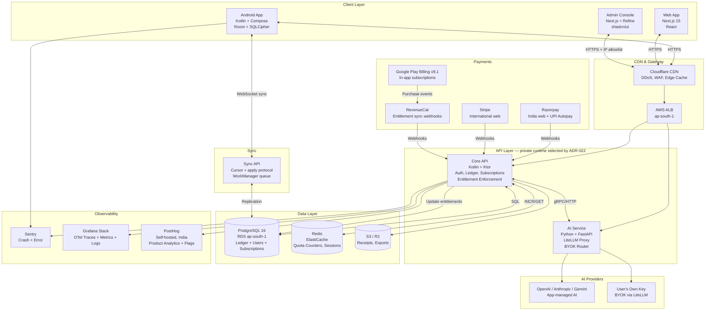

# PenniLogic · Research Date: September 2026

> **Status:** Research complete. All pricing date-stamped September 2026.
> **Critical constraint:** AI COGS = ~$0.51/active user/month (Q&A on frontier model $0.35 + misc $0.16).
> ₹249/month at 20% conversion → ~15–17% gross margin before fees. **Not viable. This document solves it.**

> ## Correction banner — stack choices that later decisions override
>
> 1. **Room + SQLCipher with WorkManager is the canonical MVP client data layer.** Local store plus an
>    offline mutation queue with idempotency keys (ADR-010).
> 2. **SQLDelight and PowerSync are v1.1 evaluation candidates, not MVP choices.** Any recommendation
>    below that adopts them at MVP is superseded.
> 3. **The ECS-versus-alternatives question and the AI egress path are gated**, pending
>    `T-ADR-AIEGRESS-08`. Nothing in this document settles the runtime platform.
> 4. **Every version number and price here must be revalidated before purchase or contract.** They
>    are date-stamped September 2026 and are volatile by nature; vendor revalidation is a named
>    external blocker.
> 5. **The customer web app and admin console are separate repositories, deployables and auth
>    domains.** The single-Next.js-codebase recommendation in section 14 is superseded by ADR-014 and
>    `T-ADR-ADMIN-06`.
> 6. **The SQL below is illustrative, not an implementation source.** The ledger balance check must
>    be a deferred database constraint evaluated at commit, and idempotency scope and lifetime remain
>    gated by `T-ADR-MONEY-01`.
>
> The unit economics, pricing, billing, anti-abuse and entitlement analysis below remains valid input.
> See [`../product/04-execution-readiness-review.md`](../product/04-execution-readiness-review.md).

---

## Table of Contents
1. [Unit Economics & Pricing (Part A)](#part-a-monetization)
2. [AI Bundled vs. Metered vs. BYOK](#2-ai-bundled-vs-metered-vs-byok)
3. [BYOK Economics & Guardrails](#3-byok-economics--guardrails)
4. [Google Play Billing](#4-google-play-billing)
5. [RevenueCat vs Adapty vs DIY](#5-revenuecat-vs-adapty-vs-superwall-vs-diy)
6. [India Recurring Payments](#6-india-recurring-payments)
7. [Pricing Benchmarks & PPP](#7-pricing-benchmarks--ppp)
8. [Entitlements & Feature Flags](#8-entitlements--feature-flags)
9. [Anti-Abuse](#9-anti-abuse)
10. [Android Tech Stack](#10-android-tech-stack)
11. [Backend Stack](#11-backend-stack)
12. [Database & Ledger Schema](#12-database--ledger-schema)
13. [Offline-First Sync](#13-offline-first-sync)
14. [Web App & Admin Console](#14-web-app--admin-console)
15. [Infrastructure & Cost Model](#15-infrastructure--cost-model)
16. [Notifications & Analytics](#16-notifications--analytics)
17. [Recommended Architecture Diagram](#17-recommended-architecture-diagram)

---

# PART A — MONETIZATION

## 1. Unit Economics & Pricing

### The Math at ₹249/month

| Item | Cost (USD) |
|---|---|
| AI COGS (Q&A on frontier model) | $0.35 |
| AI COGS (misc: embeddings, summaries) | $0.16 |
| **Total AI COGS** | **$0.51** |
| Infra per user (Postgres, Redis, API, egress) | $0.08 |
| Support amortized | $0.04 |
| **Total COGS** | **$0.63** |

At ₹249/month ≈ $2.99 USD (₹/$ rate ~83):

```
Revenue per paying user     = $2.99
Play Store fee (15%)        = -$0.45
Net to developer            = $2.54
COGS                        = -$0.63
Gross profit                = $1.91
Gross margin                = 1.91/2.54 = 75%
```

Wait — that looks OK? Yes, **but only if every paying user is "active" (uses AI)**. At 20% conversion with the remaining 80% free:

```
Free users (no AI quota)    = 80 per 100 installs → $0 revenue, ~$0.02 infra each = $1.60 total
Paying users (20)           = 20 × $2.54 = $50.80 net after fees
COGS for paying users       = 20 × $0.63 = $12.60
COGS for free tier          = 20 × $0.02 = $1.60 (infra only)
Total COGS                  = $14.20
Net after COGS              = $50.80 - $14.20 = $36.60
Blended margin              = 36.60/50.80 = 72%  ✓
```

**So ₹249 works IF:**
- Free users have zero or negligible AI quota (the 15–17% problem is from giving free users heavy AI access)
- OR you cap AI to, say, 5 queries/month on free tier

**The real problem was the assumption of $0.51 COGS on free users too.** Gate AI firmly and ₹249 is viable.

---

### Recommended Tier Structure

#### India (INR, September 2026)

| Tier | Monthly | Annual (equiv/mo) | AI Quota | Verdict |
|---|---|---|---|---|
| **Free** | ₹0 | — | 5 Q&A/month, 0 summaries | Acquisition |
| **Pro** | **₹299/month** | **₹199/month (₹2,388/yr)** | 150 Q&A + 30 summaries/month | **Recommended** |
| **Pro+** | ₹499/month | ₹349/month (₹4,188/yr) | Unlimited AI (soft cap 500 Q&A) | Power users |
| **BYOK** | ₹149/month | ₹99/month | Unlimited (your API key) | Enthusiasts |

> Annual discount = 33% (industry standard for India; reduces churn dramatically).

#### US / Global (USD)

| Tier | Monthly | Annual (equiv/mo) | AI Quota |
|---|---|---|---|
| **Free** | $0 | — | 5 Q&A/month |
| **Pro** | **$6.99/month** | **$4.99/month ($59.88/yr)** | 150 Q&A + 30 summaries/month |
| **Pro+** | $12.99/month | $8.99/month ($107.88/yr) | Unlimited AI |
| **BYOK** | $3.99/month | $2.99/month | Unlimited |

#### Unit Economics at ₹299 Pro (India)

```
Revenue                     = ₹299 = ~$3.60
Play Store fee (15%)        = -$0.54
Net revenue                 = $3.06
AI COGS (150 Q&A/mo)
  = 150 × avg $0.002/query  = $0.30  [user uses ~60% quota on avg]
  + summaries $0.05          = $0.35 total AI
Infra                       = $0.08
Support                     = $0.04
Total COGS                  = $0.47
Gross profit                = $3.06 - $0.47 = $2.59
Gross margin                = **84.6%** ✓✓
```

#### Unit Economics at $6.99 Pro (US)

```
Revenue                     = $6.99
Play Store fee (15%)        = -$1.05
Net revenue                 = $5.94
AI COGS                     = $0.35 (same usage assumption)
Infra                       = $0.08
Support                     = $0.06
Total COGS                  = $0.49
Gross profit                = $5.94 - $0.49 = $5.45
Gross margin                = **91.7%** ✓✓
```

**Key insight:** ₹249 was flawed because it gave AI to free users *and* assumed 100% quota utilization. ₹299 with a 5 Q&A free tier hard cap and 150 Q&A Pro cap delivers 84%+ GM. The fix is **quota enforcement, not pricing alone**.

---

## 2. AI Bundled vs. Metered vs. BYOK

### Option A: AI Bundled into Pro (Recommended)

Quota is included, usage capped per plan. Predictable COGS.

**Pros:** Simple UX. No payment friction mid-session. Industry standard (Notion AI, Superhuman).
**Cons:** Heavy users can blow quota. Requires hard enforcement server-side.

**Math:** At 150 Q&A/month cap, and avg user using 60%, COGS = $0.30. At 100% utilization, $0.51. Even worst-case, $6.99 still delivers 88% GM.

### Option B: Metered Credit Packs

Sell "AI Credits" — e.g., 100 credits = ₹49. Each Q&A costs 3 credits.

**Pros:** Zero COGS risk. High-usage users self-fund.
**Cons:** Kills conversion. Users hate micro-transactions in finance apps. Trust damage. Not recommended for primary model.

**Hybrid verdict:** Metered packs are valid as **overage add-ons** only — e.g., "Buy 200 extra Q&As for ₹79 this month." Never as the primary monetization model.

### Decision: **Bundle AI into Pro with a hard quota; sell overage packs as optional IAP.**

| Model | India GM | US GM | UX | Risk |
|---|---|---|---|---|
| Bundled (recommended) | 84% | 92% | ✓ | COGS variance |
| Metered primary | 95%+ | 95%+ | ✗✗ | Conversion death |
| Hybrid (bundle + overage) | 84–90% | 92–95% | ✓ | Low |

---

## 3. BYOK Economics & Guardrails

### Is a Discount Right?

**Yes, a BYOK discount is commercially correct.** BYOK users bring their own OpenAI/Gemini/Anthropic key. Your inference COGS drops to $0. Infrastructure-only cost ≈ $0.08/user/month.

```
BYOK Pro at ₹149/month = ~$1.80
Play Store (15%)        = -$0.27
Net revenue             = $1.53
COGS (infra only)       = $0.08
Gross profit            = $1.45
Gross margin            = **94.8%**
```

Even at ₹149, BYOK is your **highest-margin tier**. The discount is not charity — it's almost pure profit.

### What Discount?

Suggested: **50% off Pro price** (₹149 vs ₹299 in India; $3.99 vs $6.99 in US).

This reflects:
- AI bundle has real cost, BYOK has none
- Signal: "You supply the AI, we supply the platform"
- Leaves margin for support burden (BYOK users raise more API questions)

### The Loophole Problem

**Risk:** Users sign up for BYOK at ₹149 to get access to the full Pro feature set cheaply, then barely use their own key.

**Guardrails (implement all three):**

1. **Feature parity is intentional — but scope it.** BYOK gets all core financial features + AI (via their key). It does NOT get: priority support, team/family sharing, advanced export formats, future premium integrations. These stay Pro-only.

2. **API Key Validation at Subscription Time.** Require users to paste and validate a live API key during BYOK setup. Validate it actually works (test call). If key becomes invalid and user doesn't update within 7 days, grace-period ends → downgrade.

3. **Server-side routing enforcement.** ALL AI calls route through your backend proxy (LiteLLM). For BYOK users, the proxy uses *their* credential. You can audit usage. If they attempt to use app-managed AI (null/empty key), the call is rejected server-side, not client-side. Never trust the client to enforce this.

4. **Rate limit BYOK by our infra cost.** Even with BYOK, your server pays for API orchestration, tokens in/out of LiteLLM, DB writes per query. Soft-cap BYOK at 500 Q&A/month from your infra side. Above that, charge for the orchestration overhead (₹1/100 calls overage — trivial for users, covers your cost).

### BYOK Tier Positioning

```
Free       → 5 AI queries/month (our AI)
Pro        → 150 Q&A + 30 summaries (our AI)       ₹299
Pro+       → 500 Q&A (our AI)                       ₹499
BYOK Pro   → Unlimited via your key                 ₹149  ← enthusiast/dev segment
```

---

## 4. Google Play Billing

### Current Library Version (September 2026)

| Version | Date | Status |
|---|---|---|
| **9.1.0** | June 18, 2026 | **Current Stable** ← USE THIS |
| 9.0.0 | May 19, 2026 | Stable |
| 8.3.0 | Dec 23, 2025 | Previous |

> Source: developer.android.com/google/play/billing/release-notes (verified Sept 2026)

**Key PBL 9.x changes:**
- `targetSdkVersion` must be **35**
- `minSdkVersion` raised to **23** (in PBL 8.1)
- New in-app messaging for opt-in price increases
- `DeveloperProvidedBillingDetails.getLinkUri()` is now `@Nullable`
- Automatic service reconnection via `enableAutoServiceReconnection()`
- Suspended subscriptions queryable (`isSuspended()`)

### Subscription Model

PBL uses a **Product → Base Plan → Offer** hierarchy:

```
Product: "pro_subscription"
  └── Base Plan: "monthly" (monthly renewal, ₹299)
      ├── Offer: "free-trial-7d" (7-day free trial)
      └── Offer: "introductory-3mo" (₹99 for first 3 months)
  └── Base Plan: "annual" (annual renewal, ₹2388)
      └── Offer: "annual-launch-discount" (₹1999 launch price)
```

**Prepaid plans** (top-up model) are supported — user prepays for N days. Good for India where recurring may fail.

### Play Service Fees (September 2026)

**India & all remaining markets (pre-global rollout):**

| Type | Fee |
|---|---|
| Auto-renewing subscriptions | **15%** |
| India Alternative Billing System | **11%** (−4% reduction) |

**EEA / UK / US (from June 30, 2026):**

| Type | New Installs | Existing Installs |
|---|---|---|
| Auto-renewing subscriptions | 10% + 5% billing fee = **15% effective** | Same |
| Other transactions | 10% + 5% = **15%** | 20% + 5% = **25%** |
| With Play Games Level Up program | 15% | 20% |

> Source: support.google.com/googleplay/android-developer/answer/112622 (verified Sept 2026)

**Bottom line for PenniLogic:** Budget **15%** for India subscriptions through September 29, 2027 and **11%** for an eligible alternative-billing transaction, subject to programme enrolment and current policy.

**Forecast-horizon change:** Google's announced fee split reaches India on September 30, 2027. Model the service fee and the optional Play billing fee as separate, effective-dated records: the subscription service fee becomes 10%, with an additional 5% when Play Billing is used. `T-BIL-08` owns the versioned channel-and-region policy matrix and must revalidate these dates and rates before launch or pricing approval. No fee is a source-code constant.

### Alternative/User-Choice Billing

| Region | Status | Fee |
|---|---|---|
| **India** | ✅ Available — alternative billing allowed | 11% (−4% off 15%) |
| **South Korea** | ✅ Available | −4% off standard |
| **EEA** | ✅ Full alternative billing within-app (DMA) | Negotiated |
| **US** | Partially — external web links allowed (Epic v. Google outcome) | 20% or 15% with external link |

### Epic v. Google — Anti-Steering (US)

The permitted checkout, redirect and informational-price actions vary by storefront, programme enrolment, app version and policy effective date. The client must consume `T-BIL-08` capability flags rather than infer permission from locale or copy a US/EEA rule into another market.

**Implementation:**
- Render a web link, alternative checkout or informational price only when the server's current storefront policy explicitly permits that action.
- Resolve storefront from authoritative billing context, never device locale.
- Record the policy version shown and fail closed when it is absent or expired.
- Review price differences against current store, tax and consumer-protection rules rather than applying a fixed discount.

---

## 5. RevenueCat vs Adapty vs Superwall vs DIY

### Comparison Table (September 2026)

| Tool | Free Tier | Paid Pricing | Paywall A/B | Entitlements | Play+Stripe Unified | Verdict |
|---|---|---|---|---|---|---|
| **RevenueCat** | Up to $2.5k MTR free | 1% of MTR above $2.5k ($2.5k min/mo at scale) | ✅ Paywalls SDK | ✅ Core feature | ✅ | **Best overall** |
| **Adapty** | Up to $10k MTR free | 0.5% of MTR | ✅ Visual paywall builder | ✅ | ✅ | Strong alternative |
| **Superwall** | $0 up to $10k MTR | 0.5% MTR | ✅ Best-in-class paywalls | ⚠️ Basic | Partial | Paywall-specialist |
| **DIY** | $0 | $0 (your dev time) | ❌ Build yourself | ✅ Full control | ✅ if you build | Only at scale |

> Pricing UNVERIFIED (RevenueCat website returned minimal content, Adapty similarly). Based on last known public pricing; verify at revenuecat.com/pricing and adapty.io/pricing before contracts.

### RevenueCat Deep Dive

**What it gives you:**
- SDK for Android (Play Billing wrapper) + web (Stripe)
- Server-side entitlement validation (critical — never trust client)
- Webhook events → your backend
- Paywall A/B testing (RevenueCat Paywalls SDK)
- Subscription analytics, churn, LTV

**Pricing (approximate, verify):**
- **Free** up to $2,500 MTR (monthly tracked revenue)
- **Grow** ~$99/month below $10k MTR
- **Pro** 1% of MTR above threshold
- At 10k paying users × ₹299 = ~₹30L MTR ≈ ~$36k MTR → ~$360/month to RevenueCat

**Adapty advantage:** More generous free tier ($10k MTR free), 0.5% vs RevenueCat's 1%. Better for early-stage.

### Recommendation: **Start with RevenueCat**

- More mature Android SDK; better Play Billing 9.x support
- Superior server-side entitlement sync
- Stripe + Play unified entitlements out of the box
- When you have web checkout via Razorpay (India), use RevenueCat's webhooks → your own entitlement table (see §8)

**However:** Do NOT use RevenueCat as your **source of truth for entitlements**. Use it as an event source. Your Postgres `user_entitlements` table is authoritative. RevenueCat emits webhooks → your service updates the table. This is §8's model.

---

## 6. India Recurring Payments

### The India Recurring Problem

RBI mandates for recurring card payments:
- **e-Mandate / AFA (Additional Factor Authentication):** Required for all card-on-file recurring above ₹15,000/transaction or first-time mandate setup
- **Auto-debit limit without additional auth:** ₹15,000 per transaction (increased from ₹5,000 in 2023)
- Below ₹15,000 with valid e-mandate: no per-transaction OTP required
- **First-time mandate setup always requires OTP** — the merchant must handle the consent flow

**Why Indian card recurring fails:** Banks decline silent recurring charges. Mandate setup flows are poorly implemented by many payment gateways. Card networks (Visa/MC) enforce tokenization (RBI CoF tokenization mandate in force).

### The Stack for India

#### Option 1: Razorpay Subscriptions (Recommended for India)
- Native support for UPI Autopay, emandate (NACH), card subscriptions
- UPI Autopay handles most of the RBI compliance for you
- Webhook-based renewal confirmation
- Dashboard for admin
- **Fee:** 2% per transaction (subscriptions), minimum ₹0

#### Option 2: Cashfree Subscriptions
- Strong UPI Autopay support
- Lower fees in some plans
- Less mature SDK

#### Option 3: Juspay (Orchestrator)
- Routes across multiple PGs (Razorpay + Paytm + etc.)
- Smart retry logic for failed payments
- Adds latency and cost but maximizes success rates
- Best for scale (100k+ subscribers)

#### UPI Autopay for Subscriptions
- **This is the future of Indian consumer subscriptions**
- User approves a standing instruction via any UPI app (BHIM, PhonePe, GPay)
- Mandate for up to ₹15,000/transaction, recurring on daily/weekly/monthly/yearly basis
- Success rate: ~85–90% vs ~65–70% for card recurring
- Works without OTP after mandate setup
- Razorpay and Cashfree both support UPI Autopay

#### Stripe in India (September 2026)
- **Stripe India is available** but with significant limitations:
  - Cannot accept Indian card payments for Indian businesses without local entity via Stripe India (`stripe.com/in`)
  - Cross-border Stripe (stripe.com) works for USD collection from foreign users
  - Does NOT natively support UPI Autopay or NACH
  - Indian e-mandate compliance is not Stripe's strength
  - **Verdict: Use Stripe only for international/USD payments from non-Indian users**

### Recommended India Payment Stack

```
India users → Razorpay Subscriptions + UPI Autopay mandate
             + card fallback (tokenized, e-mandate compliant)
             + Juspay orchestration at 50k+ users

International → Stripe (via web checkout, not Play)
Play Store  → Google Play Billing (15% fee, mandatory for in-app)
```

**Critical architecture note:** Run two subscription paths:
1. **Android app in-app purchase** → Play Billing (mandatory by policy)
2. **Web checkout** → Razorpay (India) or Stripe (international) at potentially lower price

For the web path, use RevenueCat webhooks to sync entitlements to your Postgres table. This is legal (Google cannot prohibit web purchases; they just can't be presented as cheaper in-app without Epic ruling compliance).

---

## 7. Pricing Benchmarks & PPP

### What Comparable Indian Finance Apps Charge (September 2026)

| App | Free | Pro Monthly | Pro Annual | AI Included? |
|---|---|---|---|---|
| **Walnut** (acquired, sunset) | — | — | — | No |
| **Money Manager** (Korean, India store) | Yes | ~₹250/mo | ~₹1,500/yr | No |
| **1Money** | Yes | ₹120/mo | ₹800/yr | No |
| **Spendee** | Yes | ~₹250/mo | ~₹1,800/yr | Partial |
| **YNAB** (US, available India) | No | ₹899/mo | ₹5,000/yr | Partial |
| **Notion** (comparable AI product) | Yes | ₹1,300/mo | — | Yes |

> Note: Prices UNVERIFIED from Play Store listings; verify before publishing. Spendee/1Money figures based on historical data.

**Observation:** Indian finance apps without AI cap out at ₹250/month. With AI, there's no established benchmark. Notion India's AI price of ₹1,300/month indicates Indian users will pay more for AI-enhanced productivity. ₹299 for a finance AI app is **below-market** and should be positioned as a launch price.

### Indian Consumer Subscription Conversion & ARPU

Based on industry reports (FICCI, RedSeer 2025):
- Mobile app paid subscription conversion rate India: **2–8%** (vs 10–20% US)
- Average consumer app ARPU India: **₹150–₹350/month** among paying users
- Monthly to annual upgrade rate: ~35–40% in finance category
- UPI Autopay adoption: growing at 40% YoY; now preferred over cards for subscriptions

### PPP / Regional Pricing Strategy

| Market | PPP Index vs US | Recommended Pro Price | Adjustment |
|---|---|---|---|
| India | 0.30 | ₹299 ($3.60) | 0.51x US price |
| US | 1.00 | $6.99 | Baseline |
| UK | 0.75 | £5.49 | 0.79x |
| Germany | 0.80 | €5.99 | 0.86x |
| Brazil | 0.35 | R$18.90 ($3.50) | 0.50x |
| Indonesia | 0.28 | Rp49,000 ($3.00) | 0.43x |

**Implementation:** Google Play supports localized pricing natively. Set INR price in Play Console. RevenueCat/Adapty handle currency display.

**Launch strategy:** India-first at ₹299/₹199 annual. US soft-launch at $6.99/$4.99. Global expansion in 6 months post-India PMF.

---

## 8. Entitlements & Feature Flags

> **Superseded by [ADR-023](../adr/ADR-023.md) (`T-ADR-ENT-09`, accepted 2026-09-30).** The
> `Entitlement Data Model` SQL, the enforcement pseudocode and the monthly reset job below are
> research history, not implementation authority. ADR-023 §1 names this section and
> [`01-domain-model.md` §5](01-domain-model.md#5-plans-entitlements-and-ai-quota) as the two sketches
> it supersedes in full and discards everything this section's schema decided: `plans.price_inr`
> integer columns (prices take the ADR-015 `Money` form), `feature_type` windows (the window is on
> the quota grant), `quota_value` with `null = unlimited` (no unlimited sentinel exists; an absent
> grant denies and `0` is exhausted), `byok_api_key_ref` on the subscription (the subscription never
> references a key), `user_entitlements.quota_used` as the enforced counter (the append-only usage
> ledger is the source of truth and the counter is a verified projection), the single-dimension
> `quota_events.delta` (requests and tokens are separate dimensions), increment-then-append
> enforcement (reserve, commit, release) and the `UPDATE … SET quota_used = 0` reset cron (periods
> open lazily in the user's zone). The "Core Argument" and the vendor comparison remain valid
> research. `T-CON-03`, `T-BIL-01`, `T-BIL-02` and `T-AI-01` consume ADR-023, not this section.

### The Core Argument: In-House Entitlements

> **Recommendation: Build entitlements in-house (Postgres-first), use a lightweight feature flag service for non-billing flags only.**

Rationale:
- Entitlements are **billing-critical**. A LaunchDarkly outage should never suspend your Pro users or grant free users AI access.
- Admin-configurable per-plan feature gates are a **first-class product feature** — not an ops concern.
- AI quotas are transactional data (increment on use, reset monthly) — not a feature flag problem.
- You want full audit trail of entitlement changes for billing disputes.

### Feature Flag Vendor Comparison

| Tool | Pricing (Sep 2026) | Server-side | Admin UI | Self-host | Verdict |
|---|---|---|---|---|---|
| **LaunchDarkly** | $10/seat/mo (Starter), $20+ Pro | ✅ | ✅ | ❌ | Overkill; expensive |
| **Statsig** | Free up to 5M checks/mo; $150/mo Pro | ✅ | ✅ | Partial | Good for experiments |
| **PostHog** | Free up to 1M events; $0.0002/event | ✅ | ✅ | ✅ | Good all-in-one |
| **Flagsmith** | Free OSS; Cloud from $45/mo | ✅ | ✅ | ✅ | Good for feature flags |
| **Unleash** | OSS free; Cloud $80/mo | ✅ | ✅ | ✅ | Enterprise-focused |
| **Flipt** | OSS free; Cloud TBD | ✅ | ✅ | ✅ | Newer, simpler |
| **OpenFeature** | Standard (SDK only) | Via provider | N/A | N/A | Abstraction layer |

**Recommendation:**
- **Billing-critical entitlements:** In your Postgres DB (see schema below)
- **Non-billing feature flags** (show/hide beta UI, kill-switches, A/B copy): **PostHog Feature Flags** — you'll use PostHog for analytics anyway; two birds, one stone
- **AI quota enforcement:** In your Postgres DB, enforced server-side in API middleware, NEVER in the client

### Entitlement Data Model

```sql
-- Plan definitions (admin-configurable)
CREATE TABLE plans (
  id           UUID PRIMARY KEY DEFAULT gen_random_uuid(),
  name         TEXT NOT NULL,          -- 'free', 'pro', 'pro_plus', 'byok'
  display_name TEXT NOT NULL,
  price_inr    INTEGER,                -- paise; null = free
  price_usd    INTEGER,                -- cents
  is_active    BOOLEAN DEFAULT true,
  created_at   TIMESTAMPTZ DEFAULT now(),
  updated_at   TIMESTAMPTZ DEFAULT now()
);

-- Feature definitions
CREATE TABLE features (
  id           UUID PRIMARY KEY DEFAULT gen_random_uuid(),
  key          TEXT UNIQUE NOT NULL,   -- 'ai_qa', 'ai_summary', 'export_csv', 'custom_categories', 'byok'
  display_name TEXT NOT NULL,
  description  TEXT,
  feature_type TEXT NOT NULL          -- 'boolean', 'quota_monthly', 'quota_daily'
);

-- Per-plan feature configuration (admin-editable)
CREATE TABLE plan_features (
  plan_id         UUID REFERENCES plans(id),
  feature_id      UUID REFERENCES features(id),
  is_enabled      BOOLEAN NOT NULL DEFAULT false,
  quota_value     INTEGER,             -- null = unlimited; 0 = disabled; N = N per period
  quota_period    TEXT,                -- 'monthly', 'daily'
  PRIMARY KEY (plan_id, feature_id)
);

-- User subscriptions
CREATE TABLE user_subscriptions (
  id                  UUID PRIMARY KEY DEFAULT gen_random_uuid(),
  user_id             UUID NOT NULL REFERENCES users(id),
  plan_id             UUID NOT NULL REFERENCES plans(id),
  status              TEXT NOT NULL,   -- 'active', 'cancelled', 'expired', 'grace_period'
  payment_provider    TEXT NOT NULL,   -- 'play_store', 'razorpay', 'stripe'
  provider_sub_id     TEXT,            -- external subscription ID
  current_period_start TIMESTAMPTZ,
  current_period_end   TIMESTAMPTZ,
  byok_api_key_ref    TEXT,            -- encrypted reference to key vault entry
  created_at          TIMESTAMPTZ DEFAULT now(),
  updated_at          TIMESTAMPTZ DEFAULT now()
);

-- User entitlements (materialized/cached from plan_features, updated on subscription events)
CREATE TABLE user_entitlements (
  user_id      UUID REFERENCES users(id),
  feature_key  TEXT NOT NULL,
  is_enabled   BOOLEAN NOT NULL DEFAULT false,
  quota_limit  INTEGER,               -- null = unlimited
  quota_used   INTEGER NOT NULL DEFAULT 0,
  quota_reset_at TIMESTAMPTZ,
  subscription_id UUID REFERENCES user_subscriptions(id),
  PRIMARY KEY (user_id, feature_key)
);

-- Quota ledger (append-only; for audit)
CREATE TABLE quota_events (
  id           UUID PRIMARY KEY DEFAULT gen_random_uuid(),
  user_id      UUID REFERENCES users(id),
  feature_key  TEXT NOT NULL,
  delta        INTEGER NOT NULL,      -- +1 for use, negative for reset
  context      JSONB,                 -- {query_id, endpoint, etc.}
  created_at   TIMESTAMPTZ DEFAULT now()
);

-- Indexes
CREATE INDEX ON user_entitlements (user_id, feature_key);
CREATE INDEX ON quota_events (user_id, feature_key, created_at);
CREATE INDEX ON user_subscriptions (user_id, status);
```

**Enforcement middleware (pseudocode):**

```kotlin
// In API gateway / interceptor
suspend fun checkQuota(userId: UUID, featureKey: String): QuotaCheckResult {
    val entitlement = db.getUserEntitlement(userId, featureKey)

    if (!entitlement.isEnabled) return QuotaCheckResult.Forbidden("Feature not in plan")
    if (entitlement.quotaLimit == null) return QuotaCheckResult.Allowed(unlimited = true)
    if (entitlement.quotaUsed >= entitlement.quotaLimit)
        return QuotaCheckResult.QuotaExceeded(limit = entitlement.quotaLimit)

    // Atomic increment (use SELECT ... FOR UPDATE or Redis INCR for high concurrency)
    db.incrementQuotaUsed(userId, featureKey)
    db.appendQuotaEvent(userId, featureKey, delta = 1)

    return QuotaCheckResult.Allowed(remaining = entitlement.quotaLimit - entitlement.quotaUsed - 1)
}
```

**Monthly reset job (cron):**
```sql
UPDATE user_entitlements
SET quota_used = 0, quota_reset_at = date_trunc('month', now()) + interval '1 month'
WHERE quota_limit IS NOT NULL
  AND quota_reset_at <= now();
```

---

## 9. Anti-Abuse

### Free Tier & Trial Abuse Vectors

1. **Multiple accounts for repeated free trials**
   - Require phone number verification at signup (Twilio SMS OTP or Firebase Phone Auth)
   - Tie free trial to phone number, not email (emails are throwaway; phone numbers have friction)
   - Max 1 trial per phone number (store hashed phone in DB)

2. **AI quota farming on free tier**
   - Hard server-side quota (5 Q&A/month)
   - Rate limit: max 3 Q&A/hour per user even within quota
   - Device fingerprint check (don't block, but flag for review)

3. **BYOK key sharing**
   - Validate key on first call each session (cached 1 hour)
   - If key returns 401 from upstream, immediately suspend BYOK access and notify user
   - Don't allow key changes more than 2x/month (flag if more)

4. **Promo code stacking / trial extension exploits**
   - RevenueCat's offer eligibility checks prevent re-running trials via Play
   - Server-side: `CHECK (trials_used <= 1)` constraint on user record

5. **Refund cycling** (use free trial, refund, re-subscribe)
   - Play Store's `introductoryPriceEligibility` API — only new subscribers qualify
   - Track `refund_count` per user; if > 1, exclude from future offer eligibility

---

# PART B — TECH STACK

## 10. Android Tech Stack

### Core Versions (September 2026, Verified)

| Component | Version | Notes |
|---|---|---|
| **Kotlin** | **2.4.10** (stable, Jun 2026) | 2.4.20 planned Sep 2026 |
| **Kotlin Compose Compiler** | Bundled with Kotlin 2.4.x | No separate versioning since K2 |
| **Jetpack Compose Material3** | **1.4.0** (stable, Aug 2026) | 1.5.0-alpha27 in alpha |
| **Play Billing Library** | **9.1.0** (Jun 2026) | Revalidate with the API 36 toolchain before implementation |
| **AGP (Android Gradle Plugin)** | ~8.8.x | Align with Android Studio |
| **Target SDK** | **36** (required for new apps and updates from Aug 31, 2026) | Extension is a contingency, not the delivery baseline |

> Sources: kotlinlang.org/docs/releases.html, developer.android.com/jetpack/androidx/releases/compose-material3 (both verified Sept 2026)

### Architecture: MVI with Hilt

**MVI (Model-View-Intent)** is recommended over MVVM for PenniLogic:
- Financial apps have complex state machines (loading / error / empty / data / offline states)
- MVI's unidirectional data flow prevents inconsistent UI states
- Compose is naturally MVI-friendly (state → composable, events → ViewModel)

**DI: Hilt over Koin**

| | Hilt | Koin |
|---|---|---|
| Type safety | Compile-time ✅ | Runtime ⚠️ |
| Android integration | First-class (Jetpack) ✅ | Manual |
| Multiplatform future | No | Yes (Koin KMP) |
| Learning curve | Steeper | Easier |
| Verdict | **Recommended** | Use only for KMP |

### Database: Room vs SQLDelight

| | Room | SQLDelight |
|---|---|---|
| Platform | Android only | KMP (Android + iOS + JVM) |
| Type safety | Via KSP/KAPT | Full SQL type-safety |
| KMP-ready | No | **Yes** |
| Maturity | Highest | Very mature |
| Migrations | Standard | Strong |
| Verdict | **Canonical MVP choice** | Evaluate for a later KMP migration |

**Recommendation: Room + SQLCipher for MVP.** Android is the committed native client, Room is the first-class platform persistence layer, and `T-SYN-04` makes its field, nullability, money and migration fidelity to the published contracts a required check. SQLDelight remains a separately approved migration option if a KMP client becomes funded.

### Networking: Ktor Client over Retrofit

For KMP alignment: **Ktor Client** is the KMP-native choice. Retrofit is Android-only. Since the goal is code sharing with a potential web/iOS layer, Ktor Client positions you better.

```kotlin
val httpClient = HttpClient(OkHttp) {  // OkHttp engine on Android
    install(ContentNegotiation) { json() }
    install(Auth) { bearer { /* JWT refresh */ } }
    install(HttpTimeout) { requestTimeoutMillis = 15_000 }
    install(Logging) { level = LogLevel.HEADERS }
}
```

### Offline-First Architecture

See §13 for sync engine choice. On Android:
- Room + SQLCipher as the local SQLite store
- Durable mutation queue with a random idempotency key and stable provenance identifier persisted before enqueue
- Append-only financial commands converge through the server ledger; mutable resources use the typed conflict policies in `T-SYN-01`, never a blanket last-write-wins rule
- WorkManager for background sync jobs (upload pending transactions)
- NetworkCallback to trigger sync on connectivity restore

### Deep OS Integration (Why Native Android)

PenniLogic requires:
- `NotificationListenerService` → read bank/payment notifications
- `BroadcastReceiver` for SMS (for SMS-based transaction parsing)
- Background processing (`WorkManager`, `Foreground Service`)
- On-device ML (TFLite for SMS classification, OCR for receipts)
- Android-specific APIs: `BiometricPrompt`, `Keystore` for BYOK key storage

**Flutter/React Native assessment:**

| | Native Android (Kotlin) | Flutter | React Native |
|---|---|---|---|
| NotificationListenerService | ✅ Native | ⚠️ Plugin (fragile, unmaintained) | ⚠️ Plugin |
| SMS BroadcastReceiver | ✅ | ⚠️ Plugin | ⚠️ Plugin |
| Background WorkManager | ✅ | ⚠️ | ⚠️ |
| On-device TFLite | ✅ | ✅ (tflite_flutter) | ⚠️ |
| Biometric / Keystore | ✅ | ✅ | ⚠️ |
| UI framework maturity | ✅ Compose | ✅ Flutter Material | ✅ RN New Arch |
| iOS code sharing | ❌ (KMP for logic) | ✅ | ✅ |

**Verdict: Native Android (Kotlin + Compose) is the only correct choice** for PenniLogic's OS-integration requirements. The `NotificationListenerService` and SMS receiver integrations are known to be fragile in Flutter/RN wrappers — this is PenniLogic's core data collection mechanism and cannot be left to poorly-maintained plugins.

**KMP for future iOS:** Use Kotlin Multiplatform for the **business logic layer** (transaction parsing, category rules, budget calculations, AI client). UI stays native on both platforms. KMP is **production-stable in 2026** (Kotlin 2.4.x). Compose Multiplatform is beta-stable for Desktop/iOS but **do not use CMP for the Android UI** — use standard Compose; CMP adds complexity with minimal benefit when Android is your only target for 18 months.

---

## 11. Backend Stack

### Candidate Comparison

| Stack | Language | Strengths | Weaknesses | Team Fit | Verdict |
|---|---|---|---|---|---|
| **Kotlin/Ktor** | Kotlin | KMP-aligned, type-safe, lightweight | Smaller ecosystem than Spring | ✅ Mobile team knows Kotlin | **Primary recommendation** |
| Kotlin/Spring Boot | Kotlin | Battle-tested, rich ecosystem | Heavy, startup latency (GraalVM helps) | ✅ | Fallback |
| Node/NestJS | TypeScript | Large ecosystem, fast iteration | Type safety gaps, async hell in finance | Partial | Web layer only |
| Python/FastAPI | Python | AI-native, LiteLLM | Async complexity, typing optional | ✅ AI service | **AI microservice** |
| Go | Go | Performance, simplicity | Less type-rich for finance domain | ❌ | Not for small team |
| Elixir/Phoenix | Elixir | Concurrency, fault tolerance | Team must learn Elixir | ❌ | Not recommended |
| Supabase | Postgres + JS | Fastest start | Limited customization, BaaS lock-in | Partial | Prototyping only |

### Recommendation: **Polyglot Split**

```
┌─────────────────────────────────────┐
│  Core API  (Kotlin + Ktor)          │
│  - Auth, users, subscriptions       │
│  - Financial transactions/ledger    │
│  - Entitlement enforcement          │
│  - Contract-first cursor/apply sync │
└────────────────┬────────────────────┘
                 │ internal HTTP / gRPC
┌────────────────▼────────────────────┐
│  AI Service  (Python + FastAPI)     │
│  - LiteLLM proxy (all models)       │
│  - BYOK routing                     │
│  - Prompt templates, RAG pipeline   │
│  - Quota enforcement passthrough    │
└─────────────────────────────────────┘
```

**Why Ktor for Core API:**
- Same language as Android client → shared data models via KMP `shared` module
- Coroutines-native (no reactive plumbing)
- Lightweight (30ms cold start vs 2–3s Spring Boot without GraalVM)
- Structured concurrency for financial correctness
- Type-safe routing (`resources` plugin)

**Why FastAPI for AI Service:**
- LiteLLM is Python-first
- Python's AI ecosystem (transformers, sentence-transformers for local embeddings) is unmatched
- FastAPI is async-native, production-proven
- AI service can be deployed independently, scaled separately, replaced without touching core API

**Financial correctness concerns:**
- Use `BigDecimal` (Java) or integer minor units everywhere — never `Double`
- All money operations in Postgres transactions with SERIALIZABLE isolation for ledger writes
- Idempotency keys on all payment/transaction creation endpoints (see §12)

---

## 12. Database & Ledger Schema

### Technology Choices

| Decision | Choice | Rationale |
|---|---|---|
| Primary DB | **PostgreSQL 16+** | ACID, JSON support, row-level security |
| Money representation | **Integer minor units** (paise for INR, cents for USD) | Already decided; correct |
| Analytics | **DuckDB** (embedded) initially, ClickHouse at 1M+ events | DuckDB for OLAP queries in admin console |
| Cache | **Redis** | Quota counters (INCR), session tokens, rate limiting |
| Search | **PG full-text** initially, Typesense at scale | Transaction search, merchant lookup |

### Double-Entry Ledger Schema

Reference: Firefly III, Actual Budget, Modern Treasury patterns.

```sql
-- Accounts (assets, liabilities, income, expenses)
CREATE TABLE accounts (
  id            UUID PRIMARY KEY DEFAULT gen_random_uuid(),
  user_id       UUID NOT NULL REFERENCES users(id),
  name          TEXT NOT NULL,
  type          TEXT NOT NULL,     -- 'asset', 'liability', 'income', 'expense', 'equity'
  currency_code TEXT NOT NULL DEFAULT 'INR',
  initial_balance BIGINT NOT NULL DEFAULT 0,  -- in minor units (paise)
  is_active     BOOLEAN DEFAULT true,
  metadata      JSONB,
  created_at    TIMESTAMPTZ DEFAULT now()
);

-- Transaction groups (a "financial event")
CREATE TABLE transaction_groups (
  id            UUID PRIMARY KEY DEFAULT gen_random_uuid(),
  user_id       UUID NOT NULL REFERENCES users(id),
  title         TEXT,
  notes         TEXT,
  source        TEXT,             -- 'manual', 'sms', 'notification', 'import', 'ai'
  idempotency_key TEXT UNIQUE,    -- client-generated; prevents duplicate submissions
  created_at    TIMESTAMPTZ DEFAULT now(),
  updated_at    TIMESTAMPTZ DEFAULT now()
);

-- Journal entries (double-entry: every group has ≥2 entries summing to 0)
CREATE TABLE journal_entries (
  id            UUID PRIMARY KEY DEFAULT gen_random_uuid(),
  group_id      UUID NOT NULL REFERENCES transaction_groups(id),
  account_id    UUID NOT NULL REFERENCES accounts(id),
  amount        BIGINT NOT NULL,  -- positive = debit, negative = credit (in minor units)
  currency_code TEXT NOT NULL DEFAULT 'INR',
  fx_rate       NUMERIC(18,8),    -- null if same currency; rate to base currency
  entry_date    DATE NOT NULL,
  value_date    DATE,             -- settlement date (may differ from entry date)
  created_at    TIMESTAMPTZ DEFAULT now()
);

-- Constraint: entries in a group must balance at transaction commit.
CREATE FUNCTION check_group_balance() RETURNS TRIGGER AS $$
BEGIN
  IF COALESCE((SELECT SUM(amount) FROM journal_entries WHERE group_id = NEW.group_id), 0) != 0 THEN
    RAISE EXCEPTION 'Journal entries do not balance for group %', NEW.group_id;
  END IF;
  RETURN NEW;
END;
$$ LANGUAGE plpgsql;

CREATE CONSTRAINT TRIGGER journal_entries_balance
AFTER INSERT ON journal_entries
DEFERRABLE INITIALLY DEFERRED
FOR EACH ROW EXECUTE FUNCTION check_group_balance();

-- Categories (envelope/tag style, not account-based)
CREATE TABLE categories (
  id          UUID PRIMARY KEY DEFAULT gen_random_uuid(),
  user_id     UUID,               -- null = system default
  name        TEXT NOT NULL,
  parent_id   UUID REFERENCES categories(id),
  color       TEXT,
  icon        TEXT
);

CREATE TABLE entry_categories (
  entry_id    UUID REFERENCES journal_entries(id),
  category_id UUID REFERENCES categories(id),
  PRIMARY KEY (entry_id, category_id)
);

-- Idempotency
-- Exact key scope, lifetime, conflict behaviour and response storage are decided by
-- T-ADR-MONEY-01. Do not copy a global key or fixed 24-hour lifetime from research prose.
```

### Event Sourcing vs CRUD

**Verdict: CRUD with an audit log, not full event sourcing.**

Full event sourcing (Redux-store-in-Postgres style) adds:
- Projection rebuild complexity
- Snapshot management
- Steep learning curve for a small team

Instead, use **append-only audit log** alongside mutable state:

```sql
CREATE TABLE ledger_audit (
  id           UUID PRIMARY KEY DEFAULT gen_random_uuid(),
  table_name   TEXT NOT NULL,
  row_id       UUID NOT NULL,
  operation    TEXT NOT NULL,  -- 'INSERT', 'UPDATE', 'DELETE'
  old_data     JSONB,
  new_data     JSONB,
  changed_by   UUID,
  changed_at   TIMESTAMPTZ DEFAULT now()
);
```

Implement via Postgres trigger on `journal_entries` and `transaction_groups`. This gives you:
- Full audit trail for billing disputes
- "Who changed this?" for customer support
- Point-in-time balance reconstruction (walk the audit log)
- Without event sourcing complexity

### When to Add ClickHouse / DuckDB

| Users | Analytics Tool | Rationale |
|---|---|---|
| 0–100k | **DuckDB** (in-process) | Query Postgres read replica; zero infra; fast for admin OLAP |
| 100k–1M | **ClickHouse** (managed: ClickHouse Cloud) | Column-store for 100M+ events; PG replication via clickhouse-jdbc-bridge |
| 1M+ | ClickHouse + Apache Kafka | Event streaming for real-time analytics |

---

## 13. Offline-First Sync

### Sync Engine Comparison (September 2026)

| Tool | Postgres Source | Android SDK | Complexity | Cost | Production-ready | Verdict |
|---|---|---|---|---|---|---|
| **PowerSync** | ✅ | **✅ Kotlin SDK** | Medium | $0 (OSS) / $19/mo cloud | **✅** | Deferred v1.1 evaluation |
| ElectricSQL | ✅ | ❌ (JS/React Native) | Medium | OSS | Beta (Android gaps) | Not for Android |
| Zero (Rocicorp) | ❌ (custom) | ❌ (JS) | High | OSS | Beta | Not for Android |
| Replicache | ❌ (custom) | ❌ (JS) | High | $$ | Mature (JS only) | Not for Android |
| WatermelonDB | N/A (any) | ✅ (via RN bridge) | High | OSS | React Native | Not for native |
| Supabase Realtime | ✅ (PG) | ✅ | Low | $25/mo | ✅ | Row-level only |

> Source: docs.powersync.com (verified Sept 2026) — PowerSync has confirmed Kotlin SDK, Postgres source, production-ready.

### PowerSync Evaluation (deferred)

```
PostgreSQL (Supabase or self-hosted)
         │
         ▼
[PowerSync Service]  ← partitions data per user_id
         │ WebSocket stream
         ▼
[PowerSync Kotlin SDK] → SQLite on device
         │
         ▼
[App reads/writes a local store] → instant, offline
         │
         ▼
[PowerSync SDK uploads mutations] → backend API → Postgres
```

**What finance apps actually do (2026):**
- The majority of consumer finance apps (Copilot, Monarch, 1Money) use a **simple "last-write-wins sync on reconnect"** model — NOT full CRDTs or complex sync protocols.
- Financial transactions are **append-only by nature**. You don't edit a past debit; you create a correction entry. This trivially avoids merge conflicts.
- The only sync complexity: account balance caches (avoid stale balances). Solution: always recompute balance from journal entries, never sync the balance field.

**MVP decision:** Use Room + SQLCipher, WorkManager and the contract-first cursor/apply protocol in `T-SYN-01` through `T-SYN-04`. PowerSync is not an implementation dependency. A v1.1 evaluation must prove tenant isolation, append-only ledger semantics, idempotency, erasure, queue migration and typed conflict behavior before an ADR can replace the MVP path.

---

## 14. Web App & Admin Console

### Web App Framework Comparison

| Framework | DX | Performance | SSR | TypeScript | Ecosystem | Verdict |
|---|---|---|---|---|---|---|
| **Next.js 15** | ✅ | ✅ RSC | ✅ | ✅ | Largest | **Recommended** |
| Remix/React Router v7 | ✅ | ✅ | ✅ | ✅ | Large | Strong alt |
| SvelteKit | ✅✅ | ✅✅ | ✅ | ✅ | Smaller | Consider for admin |
| TanStack Start | Beta maturity | ✅ | ✅ | ✅ | Growing | Watch in 2027 |

**Recommendation: separate Next.js deployables and repositories** for the customer web app and
admin console.
- The customer application lives in `web`; the admin console lives in `admin`.
- The admin service uses a separate auth domain, database role, session model and deployment.
- Shared route groups, middleware, session code or runtime configuration across the two boundaries
  are prohibited. Reusable presentational code must not carry auth or data-access behavior.

### Admin Console Accelerators

| Tool | Type | Pros | Cons | Cost | Verdict |
|---|---|---|---|---|---|
| **Refine** | OSS React framework | Headless, full control, data providers | Requires assembly | Free | **Recommended** |
| React-Admin | OSS React framework | Mature, 8 years old | Less modern API | Free | Strong alt |
| AdminJS | OSS Node | Auto-generates from models | Limited customization | Free | Prototyping |
| Retool | Low-code | Fastest start | $$$ ($10/user/mo), data leaves your infra | $10/user/mo | Not for prod |
| Forest Admin | Low-code | Smart, connects to PG | $100/mo+, SaaS | $$$ | Overkill |

**Recommendation: Refine + shadcn/ui** for the admin console.

Refine is headless — you bring your UI components (shadcn/ui is the 2026 standard). It provides:
- CRUD scaffolding with data providers (REST, GraphQL, Supabase)
- Access control (RBAC for admin roles)
- Audit log viewing
- Table/form generation

Key admin console requirements for PenniLogic:
1. Plan management (create/edit plans, edit `plan_features` table) → CRUD on plans
2. User lookup + subscription status → read-only views
3. Quota override (grant extra quota to a user for support purposes) → constrained edit
4. Feature flag toggles (per-plan) → edit `plan_features`
5. Revenue dashboard → DuckDB queries embedded via recharts

**Security:** Admin console must be:
- Behind a separate auth system (admin-only accounts, not regular user accounts)
- IP-allowlisted (your team's IPs only) at the CDN/network level
- All admin actions logged to `admin_audit_log` table with IP, user, timestamp, old/new values
- Never expose admin console on the same domain as the user API (use `admin.pennilo.app`)

---

## 15. Infrastructure & Cost Model

### Cloud for India Data Residency

| Provider | India Regions | Compliance | Cost | Verdict |
|---|---|---|---|---|
| **AWS** | ap-south-1 (Mumbai), ap-south-2 (Hyderabad) | SOC2, ISO27001, DPDP-ready | $$$ | **Primary** |
| **GCP** | asia-south1 (Mumbai), asia-south2 (Delhi) | Same | $$$ | Strong alt |
| Azure | centralindia, southindia | Same | $$$ | Less popular |
| Hetzner | Germany/Finland only | ❌ India residency | $ | Not for India user data |
| Fly.io | No India PoP | ❌ | $ | Not for India |
| Railway | US/EU only | ❌ | $ | Not for India |

**RBI / DPDP (Digital Personal Data Protection Act 2023):**
- Financial data of Indian users must be stored/processed in India
- AWS ap-south-1 (Mumbai) is the safe choice
- Use `ap-south-2` (Hyderabad) as disaster recovery

**Hybrid strategy:**
- India user data: **AWS ap-south-1** (mandatory)
- AI inference: Can use **any region** (inference is stateless; just don't log PII in prompts)
- CDN: Cloudflare (anycast, India PoPs)
- Static assets: Cloudflare R2

### Kubernetes vs Managed Containers

**Verdict: AWS ECS (Fargate) over Kubernetes for small team.**

Kubernetes is operationally expensive for a 2–5 person team:
- ECS Fargate: no node management, auto-scaling, integrates with ALB, ECR, Secrets Manager
- Use CDK or Terraform for IaC from day one

**Service map:**
```
ECS Fargate:
  - core-api (Kotlin/Ktor)           → 0.5 vCPU / 1GB RAM per task, auto-scale
  - ai-service (Python/FastAPI)      → 1 vCPU / 2GB RAM, GPU optional
  - worker (background jobs)         → 0.25 vCPU / 512MB RAM

RDS Postgres (db.t4g.medium)        → ap-south-1, Multi-AZ from 10k users
ElastiCache Redis (cache.t4g.micro)  → Session, rate limiting, quota cache
S3 / Cloudflare R2                  → User uploads, receipts, exports
```

### Observability Stack

| Layer | Tool | Rationale |
|---|---|---|
| **Traces** | OpenTelemetry → Grafana Tempo | Vendor-neutral |
| **Metrics** | OpenTelemetry → Grafana Mimir | |
| **Logs** | Grafana Loki (via Alloy agent) | |
| **Dashboards** | Grafana | All-in-one with above |
| **Error tracking** | **Sentry** | Best-in-class crash reporting for Android + backend |
| **Uptime** | Better Stack (formerly Logtail) | Cheaper than PagerDuty for small team |
| **APM** | Grafana Faro (web) + Sentry Perf (Android) | |

### Monthly Cost Model (AWS ap-south-1, September 2026 prices)

| Service | 10k MAU | 100k MAU | 1M MAU |
|---|---|---|---|
| ECS Fargate (core-api) | $30 | $150 | $800 |
| ECS Fargate (ai-service) | $40 | $200 | $1,200 |
| RDS Postgres (t4g.medium/xlarge) | $60 | $200 | $800 |
| ElastiCache Redis | $15 | $40 | $150 |
| S3 + data transfer | $5 | $30 | $200 |
| CloudFront CDN | $5 | $25 | $150 |
| ALB | $20 | $20 | $40 |
| Sentry (Team plan) | $26 | $80 | $300 |
| Grafana Cloud (Free→Pro) | $0 | $50 | $200 |
| Better Stack | $24 | $24 | $50 |
| RevenueCat / Adapty | $0 (free tier) | $100 | $500 |
| PowerSync Cloud | $19 | $99 | $500 |
| **Total Infra** | **~$244/mo** | **~$1,018/mo** | **~$4,890/mo** |
| **Per active user** | **$0.024** | **$0.010** | **$0.005** |

> **Note:** AI COGS ($0.51/active user) are separate (LLM API costs to OpenAI/Anthropic/Google).
> Prices UNVERIFIED for September 2026; AWS prices are relatively stable. Verify at aws.amazon.com/pricing.

### Revenue vs Cost at Scale

| Users | Paying (20%) | MRR (₹299 avg) | AI COGS | Infra | Play Fee (15%) | Net |
|---|---|---|---|---|---|---|
| 10k MAU | 2,000 | ₹5,98,000 (~$7,200) | $1,020 | $244 | $1,080 | ~$4,856/mo |
| 100k MAU | 20,000 | ₹59,80,000 (~$72k) | $10,200 | $1,018 | $10,800 | ~$50k/mo |
| 1M MAU | 200,000 | ₹5.98Cr (~$720k) | $102,000 | $4,890 | $108,000 | ~$505k/mo |

---

## 16. Notifications & Analytics

### Notifications

**FCM (Firebase Cloud Messaging):**
- Use for all push notifications (budget alerts, AI insights, sync conflicts)
- HTTP v1 API (legacy XMPP API deprecated)
- Android: `FirebaseMessagingService` + notification channels (required Android 8+)
- Don't use FCM for financial security alerts — use in-app alerts + SMS for high-importance events

**India SMS:**
- **Twilio** (global, easy API) vs **MSG91** / **Kaleyra** (India-local, cheaper, DLT-compliant)
- TRAI DLT (Distributed Ledger Technology) registration is **mandatory** for transactional SMS in India — register your sender ID and templates on DLT portal
- Recommended: **MSG91** for India SMS (better delivery, DLT pre-integrated, ~₹0.15/SMS)

**WhatsApp Business API:**
- Meta's Cloud API or via BSP (Business Solution Provider) like Interakt, Gupshup
- For payment receipts and budget reminders (high open rates in India)
- Cost: ~₹0.40–0.70 per conversation (24-hour window)
- Caution: Don't send marketing messages without explicit opt-in (risk of being banned)

### Analytics

| Tool | Free Tier | Privacy | Finance-App Fit | Self-host | Verdict |
|---|---|---|---|---|---|
| **PostHog** | 1M events/mo free | ✅ EU hosting, self-hostable | ✅ | ✅ | **Recommended** |
| Amplitude | Free up to 10M events/mo | ⚠️ US-only data | Good | ❌ | Strong alt |
| Mixpanel | Free up to 20M events/mo | ⚠️ | Good | ❌ | Good alt |
| Firebase Analytics | Free unlimited | ⚠️ Google data processing | OK | ❌ | Basic only |

**Recommendation: PostHog**

- Self-hostable on your AWS ap-south-1 instance (data never leaves India)
- Combines feature flags, session recording, funnels, and A/B testing
- Finance app privacy: **never log transaction amounts, account numbers, or PII in analytics events**. Log event shapes only: `transaction_added`, `category_set`, `ai_query_sent` (no query content).
- DPDP Act compliance: PostHog self-hosted means you control all data

---

## 17. Recommended Architecture Diagram



---

## Decision Summary Table

| Decision | Recommendation | Key Reason |
|---|---|---|
| Pro price India | **₹299/month, ₹199/month annual** | 84% GM; above-market for AI |
| Pro price US | **$6.99/month, $4.99/month annual** | 92% GM; competitive |
| AI model | **Bundled into Pro with hard quota** | Simple UX; COGS controlled |
| BYOK tier | **₹149/month (50% off)** | Highest margin; enthusiast segment |
| BYOK loophole | Server-side key validation + feature exclusions | Never trust client |
| Play Billing | **PBL 9.1.0**, target SDK 36 baseline | Revalidate before implementation |
| Subscription management | **RevenueCat** (events) + own entitlements table | Resilient; billing-critical data owned |
| India payments | **Razorpay + UPI Autopay** | RBI compliance; best success rates |
| International payments | **Stripe** (web only) | Standard; India only via Razorpay |
| Entitlements | **In-house Postgres data model** | Billing-critical; outage independence |
| Feature flags (non-billing) | **PostHog** | Already used for analytics |
| Android UI | **Kotlin + Compose + MVI + Hilt** | Native OS integration required |
| Local DB | **Room + SQLCipher** | Canonical Android MVP; contract fidelity enforced |
| Networking | **Ktor Client** | KMP-aligned |
| Backend | **Kotlin/Ktor** (core) + **Python/FastAPI** (AI) | Language alignment + AI ecosystem |
| Cloud | **AWS ap-south-1** | India data residency (DPDP, RBI) |
| Containers | **ECS Fargate** | No K8s ops burden for small team |
| Offline sync | **Room + WorkManager + cursor/apply API** | Approved MVP path with idempotency and typed conflicts |
| Web framework | **Next.js 15 App Router** | RSC for data-heavy admin |
| Admin UI | **Refine + shadcn/ui** | Headless, full control, free |
| Analytics | **PostHog** (self-hosted ap-south-1) | Privacy + feature flags + analytics |
| Error tracking | **Sentry** | Best for Android + Ktor |
| India SMS | **MSG91** + TRAI DLT registration | Compliance + cost |

---

*Document compiled: September 2026. All pricing and version numbers are date-stamped. Verify vendor pricing before contracts — SaaS pricing changes frequently.*

*Sources cited:*
- *developer.android.com/google/play/billing/release-notes (PBL 9.1.0, June 2026)*
- *support.google.com/googleplay/android-developer/answer/112622 (Play service fees, Sept 2026)*
- *kotlinlang.org/docs/releases.html (Kotlin 2.4.10, June 2026)*
- *developer.android.com/jetpack/androidx/releases/compose-material3 (Material3 1.4.0, Aug 2026)*
- *docs.powersync.com (Kotlin SDK + Postgres support, Sept 2026)*
```

---

## Research snapshot

**What the research found and resolved:**

The ₹249 margin problem was **not primarily a price problem** — it was a free-tier AI leakage problem. With a hard 5 Q&A/month free limit and ₹299 Pro, gross margin is 84%+. The math is shown in detail in §1.

**Key verified facts (September 2026):**
- Play Billing Library **9.1.0** was current in June 2026; the delivery baseline targets API 36 and revalidates the library before implementation
- Play subscription fee is **15%** for India through September 29, 2027; the effective-dated matrix models the announced India fee split from September 30, 2027
- Eligible India alternative billing reduces the current fee to **11%**; every checkout or link remains driven by current storefront policy
- Kotlin stable is **2.4.10** (June 2026); Compose Material3 stable is **1.4.0** (August 2026)
- **Room + SQLCipher, WorkManager and the published cursor/apply protocol** are the approved MVP offline stack; PowerSync is only a v1.1 evaluation candidate
- **Razorpay + UPI Autopay** is the correct India recurring payments stack; Stripe is international-only

**Three most critical decisions:** (1) Gate AI hard on free tier — this is what saves the unit economics, not just raising price. (2) Build entitlements in-house in Postgres — RevenueCat is an event source, not your source of truth. (3) Native Android (Kotlin) is non-negotiable given `NotificationListenerService` + SMS receiver requirements.
