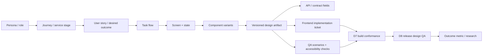
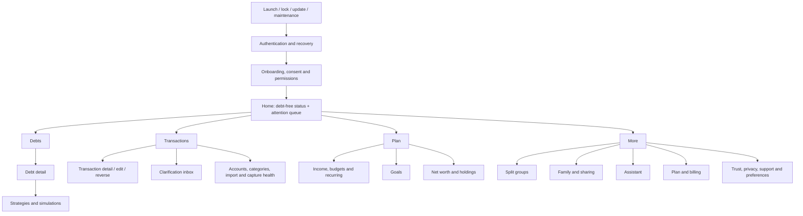
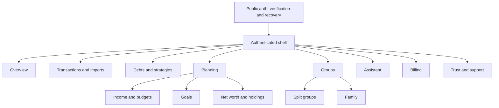
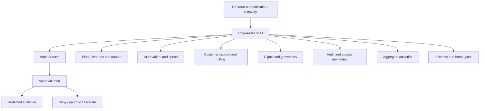
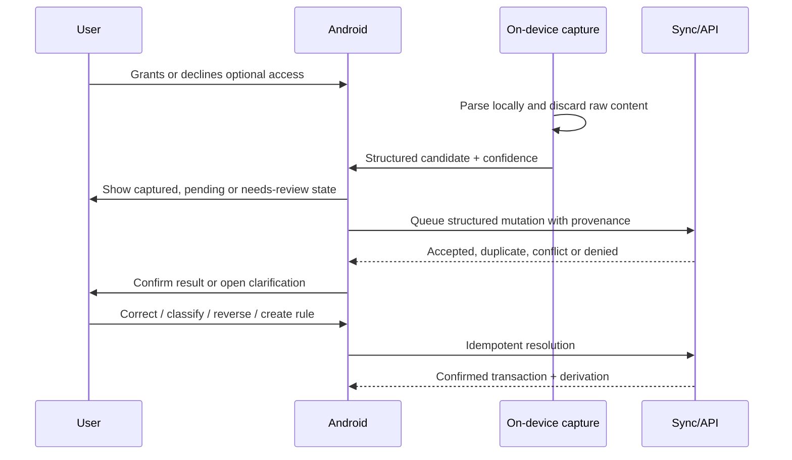
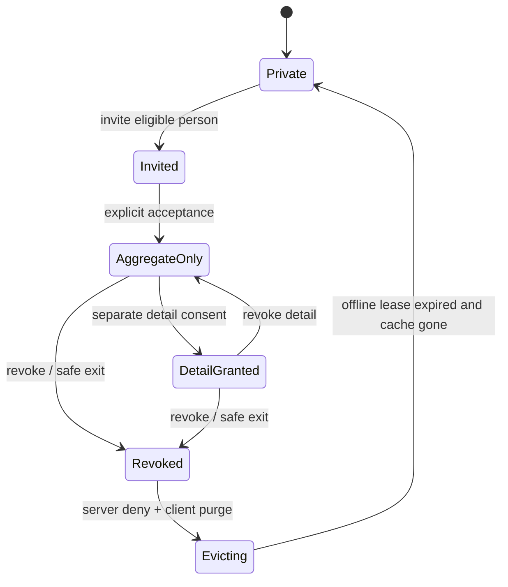
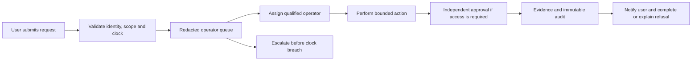
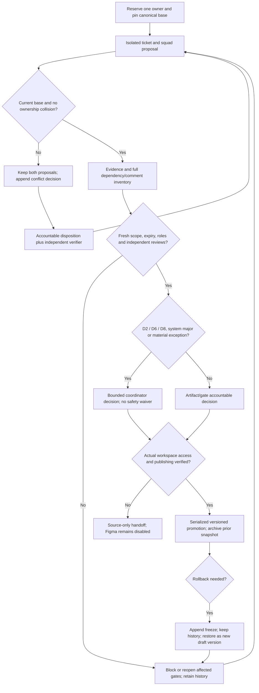

# PenniLogic experience design and SDLC plan

**Status:** design-first operating plan
**Accountable product owner:** basiltt; delegated design coordination is defined below
**Applies to:** native Android, customer web, admin/operator product, shared design system
**Source of item-level truth:** `../planning-automation/backlog-v2/`

Current design decision rights, D18 and the single-account/multiple-independent-agent operating
model are specified in [design operations](../governance/design-operations.md). CDO below denotes
that bounded decision responsibility, not a claim of a staffed human post. Role-rights acceptance
and live Figma access remain unverified; source proposals are not current approvals.

## 1. Decision

No user-facing frontend implementation may begin from a product ticket alone. It must consume:

1. approved product truth and research evidence;
2. a mapped journey, flow, screen and state specification;
3. the applicable design-system components and content patterns;
4. a tested interactive prototype for the critical path;
5. accessibility and abuse-safety findings;
6. an implementation handoff with contract and telemetry mapping; and
7. CDO design-readiness approval.

Repository scaffolding, backend contracts and non-visual platform work may proceed in parallel.
Design is therefore upstream without becoming a document waterfall: contract and design proposals
iterate concurrently, but neither frontend implementation nor release can pass on an unapproved or
stale artifact.

The machine-readable coverage registry is
`../planning-automation/backlog-v2/evidence/experience-coverage.json`. It is the exhaustive index for
personas, journeys, user stories, flows, screens, component families, diagrams and ownership. This document explains
the operating model; the registry proves coverage.

## 2. Planning assumptions

The historical plan modeled a large dedicated design and UX organization with these parallel
capacity pools. These are planning assumptions, not current staffing or evidence that discipline
roles have been appointed in the single-account operating model:

| Pool | Planned capacity | Work |
|---|---:|---|
| Product Design and UX | 6 lanes x 20 points per sprint | Research, service design, IA, platform design, design system, content, accessibility, prototypes and handoff |
| Quality Assurance | 4 lanes x 20 points per sprint | Independent UX research validation, design QA, accessibility, comprehension, parity, UAT and release conformance |
| Engineering | 3 lanes x 20 points per sprint | Existing implementation plan; design and QA capacity is not charged to engineering |

The CDO-equivalent coordinator is an approval responsibility, not a seventh production lane.
Its approval is limited to D2, D6, D8, shared-system major releases and material exceptions.
Capacity arithmetic never substitutes for an actual qualified, independently evidenced approver.

## 3. Design organization

| Role/team | Accountable outcomes | Cannot delegate |
|---|---|---|
| CDO-equivalent decision coordinator | D2 direction, D6 readiness, D8 release design evidence, shared-system major releases and material exceptions | Those bounded decisions; does not replace Product, Security or qualified Legal authority |
| Design Program Director / DesignOps | Plan, staffing, Figma topology, artifact versioning, review SLAs, dependency health, design debt and decision log | Evidence integrity and stale-artifact reporting |
| UX Research Lead | Research ethics, recruitment, sampling, consent, repository, synthesis quality and limitations | Research-method approval and participant-data controls |
| Principal Service Designer / IA Lead | Personas-to-journey model, service blueprints, platform allocation, sitemaps, navigation and cross-channel continuity | Canonical information architecture |
| Design Systems Lead | Tokens, components, variants, assets, documentation, contribution and release governance | Shared component API and breaking-change approval |
| Android Design Lead | Material 3 adaptation, compact/expanded navigation, native permissions, offline and device behavior | Android platform fidelity and complete mobile prototype |
| Web Design Lead | Responsive customer information architecture, dense financial workflows, browser/zoom behavior | Customer-web prototype and handoff |
| Admin / Enterprise Design Lead | Role-aware operator IA, queues, four-eyes workflows, dense tables and failure-safe operations | Admin prototype and operator-safety review |
| Content Design Lead | Terminology, voice, disclosures, errors, consent, permission, support and localization source copy | Canonical glossary and regulated-copy workflow |
| Accessibility and Inclusive Design Lead | WCAG/Material outcomes, assistive technology, cognitive accessibility, financial literacy and safe/coercive contexts | Accessibility acceptance and exception denial |
| UX Engineering / Handoff Lead | Token packages, component specifications, Code Connect mapping, interaction specs, assets and design-to-code contract | Handoff completeness and implementation-drift detection |
| Design QA Lead | Independent design critique, prototype validation, visual conformance and release sign-off | D5 and D8 evidence independence |
| Product/Engineering/QA leads | Feasibility, contract alignment, implementation and test mapping | Acceptance of implementation consequences in the handoff |

### 3.1 RACI by artifact

The complete versioned RACI lives in
[design-gates.json](../governance/design-gates.json), with its human-readable accountabilities in
[design operations section 2](../governance/design-operations.md#2-raci-and-accountable-artifact-ownership).
Each artifact class has exactly one accountable role and at least one independent verifier.
The contract covers research/store access, personas, journeys, IA, all three platforms, systems,
content, accessibility, handoff, readiness, conformance, release, outcomes, traceability and archive.
The UX Engineering role is accountable for the shared handoff contract; each platform role retains
its own platform artifact accountability. Actual scoped assignments and discipline-rights approvals
are required separately; this role table is not proof of staffing, consent or licensed legal review.

## 4. Design lifecycle gates

| Gate | Required evidence | Exit decision |
|---|---|---|
| D0 - Product truth | `PRODUCT.md`, constraints, known evidence, open decisions, research ethics | Accountable Product role approves the problem and boundaries |
| D1 - Experience architecture | Personas, JTBD, journeys, service blueprints, platform allocation, sitemaps and coverage registry | IA Lead approves complete topology |
| D2 - Direction | Tested concept alternatives, chosen visual/interaction thesis, accessibility pre-check and decision record | CDO selects one durable direction |
| D3 - Flow definition | Task flows, wireflows, content hierarchy, edge cases, contract assumptions and telemetry intent | Platform lead approves every mapped flow |
| D4 - System design | High-fidelity screens, responsive/adaptive variants, components, tokens, content and motion | Design Systems approves; independent artifact verification remains required |
| D5 - Prototype validation | Interactive critical paths, heuristic review, accessibility audit, moderated usability and comprehension results | Independent Design QA accepts evidence or returns revisions |
| D6 - Implementation readiness | Versioned handoff, assets, component mapping, state table, API fields, test IDs and known limitations | CDO approves platform handoff; frontend dependencies may close |
| D7 - Build conformance | Design-to-code comparison, visual regression, interaction/accessibility parity and documented deviations | Engineering accountable accepts with independent Design QA verification |
| D8 - Release design QA | Device/browser/operator walkthroughs, localization, destructive flows, privacy and final UAT | CDO signs release design evidence |
| D9 - Outcome review | Funnel/task metrics, support evidence, longitudinal research and design-debt decisions | Accountable Product role accepts, iterates or retires with independent verification |

Approval expires when a contract, user-visible policy, information architecture, component major
version or critical acceptance criterion changes. The change opens a design-impact review and
invalidates only affected artifacts; it never freezes unrelated squads.
The [machine contract](../governance/design-gates.json) supplies exact evidence keys, gate/role IDs,
maximum lifetimes and prerequisites. At expiry equality, changed scope, unresolved blocking comment,
missing evidence or revoked/unassigned reviewer authority, closure fails even if a stored status
says approved. See [freshness rules](../governance/design-operations.md#3-gate-contract-and-freshness).

## 5. Figma and artifact topology

The setup ticket specifies one governed team project with these library and product files.
**Creation, shared-file editing and publishing are disabled** until actual existing workspace
ownership/access is verified. Controlled Git is the current artifact workspace; the list is not a
claim of provisioned Figma. Exact page/branch/ownership, no-paid-feature fallback, publishing,
archive and restoration rules are in
[design operations section 6](../governance/design-operations.md#6-figma-topology-publishing-and-restoration-disabled).

1. **00 - Product truth and research:** personas, JTBD, mental models, research plans and findings.
2. **01 - Service and IA:** journey maps, service blueprints, platform allocation and sitemaps.
3. **02 - Foundations library:** color roles, typography, spacing, shape, elevation, grid, motion,
   haptics, icons, illustration and data-visualization primitives.
4. **03 - Components library:** shared semantic components plus Android, web and admin variants.
5. **10 - Android product:** one page per domain flow and one prototype page per critical journey.
6. **20 - Customer web product:** responsive page families and end-to-end prototypes.
7. **30 - Admin product:** operator role views, queues, approvals and incident prototypes.
8. **40 - Content and localization:** glossary, source copy, regulated copy and pseudo-localized stress
   cases.
9. **50 - Design QA:** test plans, annotated findings, conformance evidence and release snapshots.
10. **90 - Archive:** immutable superseded versions with replacement links; never a dumping ground.

Each file has the exact applicable pages declared in the machine topology, including controlled
Cover/Changelog/Handoff/Archive indexes. Published components require descriptions, property names, variant
coverage, accessibility notes, content limits and a named code target. Branches use ticket, squad and change slug;
reviews use Figma comments tied to a GitHub issue; releases use semantic versions. The CDO approves
library major versions and platform D6 snapshots.

## 6. Traceability contract

Every consequential surface follows this chain:

The validator fails when a registry reference is missing, a screen has no design or implementation
owner, a critical flow has no independent QA owner, a component has no state coverage, or an
implementation ticket lacks its mapped D6 prerequisite.

## 7. Personas and operating contexts

The research programme validates, refines or splits these planning personas; they are hypotheses,
not invented market evidence.

| ID | Persona hypothesis | Primary job | High-risk context |
|---|---|---|---|
| P01 | Debt-focused salaried adult | Understand payoff date and choose a feasible strategy | Anxiety, lender complexity, salary-date mismatch |
| P02 | Irregular-income household contributor | Stabilize spending and contribute toward goals | Volatile cash flow, low predictability |
| P03 | Manual/privacy-first user | Track money without granting capture permissions | Distrust, older device, low connectivity |
| P04 | Automation-seeking Android user | Capture transactions and resolve only ambiguity | Sensitive permissions, parser errors |
| P05 | Financial planner / power user | Analyze, bulk edit, import and compare scenarios on web | Dense data, multiple accounts/currencies |
| P06 | Household owner | Share selected aggregates and coordinate a joint goal | Consent, revocation, coercive control |
| P07 | Household member / safe-exit user | Understand access and leave or conceal safely | Shared device, unsafe relationship |
| P08 | Split organizer or participant | Allocate, dispute and settle a temporary group expense | Non-user invite, fairness, payment proof |
| P09 | AI-assisted user | Ask for explanation while retaining control and provenance | Hallucination, quota, provider trust |
| P10 | Support/privacy operator | Resolve a request within a service or statutory clock | Redaction, time pressure, incomplete evidence |
| P11 | Security/compliance approver | Review high-risk access or incident actions | Four-eyes separation, audit integrity |
| P12 | Billing/product operator | Change plans, quotas or providers without silent user impact | Versioning, refunds, regional policy |

Recruitment must cover varied debt types, income patterns, languages, financial literacy,
accessibility needs, device capability and permission attitudes. Household research never recruits
both members into a session that could reveal a private disclosure or create coercion.

## 8. Cross-platform information architecture

### 8.1 Android

Compact width uses Material navigation with three to five primary destinations. Expanded width uses
rail or drawer, persistent detail where appropriate and no stretched phone layout. Predictive Back,
edge-to-edge, keyboard/IME, deep links, process death, offline queue and capture-health transitions
are designed, not left to implementation.

### 8.2 Customer web

Desktop supports dense comparison, bulk action and side-by-side derivation. Tablet and narrow web
collapse navigation and tables structurally. Every page is operable at 200% zoom and keyboard-only;
mobile web remains a complete management fallback, not a banner directing users to Android.

### 8.3 Admin/operator

Navigation is an authorization result: an absent capability is neither rendered nor addressable.
There is no browse-all-users or browse-all-transactions destination. Unmasking, elevation, export
and break-glass are purpose-built flows with provenance, requester/approver separation, expiry,
notification and immutable audit.

## 9. Critical journey blueprints

### 9.1 Capture to trusted transaction

### 9.2 Household grant and safe exit

### 9.3 Rights request and operator fulfillment

## 10. Screen and state model

The coverage registry enumerates every route-level page, screen, queue, detail view, system handoff,
notification landing, widget and safety-critical overlay. `surface_type` defaults to `page`; non-page
surfaces state it explicitly. Reusable dialogs, sheets, menus, tooltips, snackbars and undo behavior
are registered as component families, while each safety-critical use is also attached to the screen
whose decision it controls. Each planning entry identifies its route, flows, components, applicable
states, design owner, implementation owner and independent QA owner.

At D6, `handoff-manifest.schema.json` adds the immutable artifact version and frame IDs, required and
optional contract data, realistic content ranges, state inheritance or reasoned exemptions,
accessibility/localization/privacy constraints, asset and telemetry manifests, approvals and expiry.
`design-readiness.schema.json` aggregates those manifests for `T-DQA-12`. The planning registry does
not pretend that uncreated Figma artifacts have already been approved.

No handoff may use "N/A" for a state without a reason. A service-unavailable state may preserve cached
data; an authorization denial must not reveal whether hidden data exists; zero is never used as an
empty or unavailable value.

## 11. Component architecture

Component coverage is grouped without hiding variants:

1. **Foundations:** semantic color, type, spacing, shape, elevation, grid, motion, haptics, icon and
   illustration roles.
2. **Navigation:** app bars, navigation bar/rail/drawer, side navigation, breadcrumbs, tabs, stepper,
   back/up, deep-link landing and responsive shell.
3. **Actions and input:** buttons, icon buttons, FAB, menu, text/number/currency/date input,
   autocomplete, select, chip, checkbox, radio, switch, slider, file/receipt upload and OTP/passkey.
4. **Financial data:** amount, balance, trend, debt progress, payoff date, schedule, derivation,
   confidence, provenance, account, category, transaction, debt, goal and net-worth primitives.
5. **Collections:** list, card, data table, timeline, pagination/cursor, search, filter, sort,
   selection, bulk action, comparison and drill-down.
6. **Feedback and state:** skeleton, progress, inline validation, banner, snackbar/toast policy,
   empty state, error, stale/offline/degraded, status badge, retry, undo and confirmation.
7. **Overlays:** dialog, alert, sheet/drawer, popover, tooltip, date picker, command menu and
   context menu with escape/focus/back behavior.
8. **Trust and control:** consent, permission rationale, privacy mask, disclosure, grant, access log,
   step-up, approval, destructive action, export, deletion, safe exit and duress concealment.
9. **Data visualization:** time series, categorical spend, debt trajectory, scenario comparison,
   composition and progress with table/text equivalents and no color-only meaning.
10. **Operator:** queue, SLA clock, redacted field, approval chain, audit event, diff, policy version,
    anomaly, incident and immutable-action receipt.

The registry publishes one closed component-state vocabulary. Every interactive component covers
default, hover where applicable, focus, active/pressed, selected, disabled, loading and error; data
components additionally cover empty, partial, stale, redacted, unconfirmed and overflow where
applicable. The D6 handoff records inherited states and reasoned exemptions rather than treating
absence as "N/A". Android uses Material 3 structure and 48dp targets. Web/admin use semantic HTML,
visible focus, complete keyboard behavior and overlays that are not clipped.

## 12. Content, localization and financial comprehension

- One glossary owns transaction, debt, principal, interest, minimum payment, APR/rate, payoff,
  available, projected, stale, pending, shared and revoked terminology.
- Consent, permissions, AI disclosure, advice boundaries, plan changes, refunds, deletion,
  unmasking and incident notices use versioned approved source copy.
- Copy states what happened, what remains safe, what the user can do and what will happen next. It
  never blames, invents a cause, guarantees an outcome or hides a destructive consequence.
- Minimum/typical/maximum strings, Indian names and addresses, currency formats, pluralization,
  translated expansion and pseudo-localization are designed before layout approval.
- Financial-comprehension research tests whether participants can explain the figure, its source,
  uncertainty and consequence; task completion without comprehension is not success.

## 13. Research programme

Research uses versioned plans, consent, recruitment criteria, scripts, raw-note access, synthesis,
limitations and disposition of findings. Required methods include:

- contextual interviews and debt/finance mental-model study;
- concept testing against the debt-first thesis and permission concerns;
- card sorting and tree testing for Android, web and admin IA;
- moderated prototype testing for every critical journey;
- unmoderated benchmark tasks after moderated defects close;
- accessibility sessions with assistive-technology users;
- financial-comprehension and regulated-copy testing;
- household privacy, coercion and safe-exit research using independent recruitment;
- operator simulations under statutory-clock and incident pressure; and
- longitudinal diary or follow-up research after beta.

`T-UXR-08` owns the unmoderated benchmark and post-beta longitudinal protocols, including cohort,
cadence, retention, stop criteria and the decisions each study may change.

Participant financial data is not required. Scenarios use synthetic accounts and messages.
Recordings, notes and incentives follow a counsel-reviewed retention and access policy.

## 14. Independent design QA and SDLC integration

Design QA is not the designer checking their own file. It owns:

- coverage-registry and traceability lint;
- heuristic review and cognitive walkthrough;
- design-system/token/component lint;
- prototype accessibility and assistive-technology evaluation;
- moderated usability and comprehension acceptance;
- responsive, device, browser, zoom and text-scale matrices;
- localization and pseudo-localization;
- privacy, shoulder-surfing, coercion and role-escalation scenarios;
- design-to-code screenshots and interaction/semantic regression;
- cross-platform parity and approved divergence;
- UAT scripts mapped to product acceptance criteria;
- release design QA and rollback comparison; and
- post-launch task-success, correction, abandonment and support analysis.

Feature QA begins at D3 by writing test intent from flows and states. Engineering E2E, component and
contract tests reference stable screen, flow, component and state IDs; Design QA verifies the built
experience at D7/D8. Neither substitutes for security testing, financial-model verification or
contract testing already owned by E25.

`T-DQA-03` through `T-DQA-09` verify pre-handoff design evidence. `T-QA-06`, `T-QA-08` and
`T-QA-13` verify the built web, Android and admin products; `T-DQA-10` compares those builds with the
approved artifacts; `T-DQA-11` performs cross-platform UAT. The platform QA gates depend on the D6
readiness evidence and consume D7/D8 conformance rather than rerunning design research.

## 15. Parallel collaboration

- Research, service design, design system and three platform squads run as separate branches/files
  with named ownership; shared pages are generated or owned by DesignOps, never edited concurrently.
- Low-fidelity flows may proceed against contract proposals. D6 cannot close until the consumed
  contract version and policy copy are frozen.
- Platform squads consume shared semantic components but may define a native variant when the
  divergence is recorded and approved.
- Design-system changes use expand/migrate/retire: add new token/component, migrate all consumers,
  then deprecate the old version. A breaking replacement never lands silently.
- Feedback has an SLA and disposition: accept, revise, decline with reason, or open decision. Figma
  comments are not an unowned backlog.
- WIP limits are enforced per design lane; CDO review and independent Design QA have their own
  queues and capacity.

### 15.1 D18 - Design change control and release approval

The [design operations contract](../governance/design-operations.md) governs the decision log,
two-squad collision tabletop, bounded WIP/SLA, exact expiry checks and privacy-safe ownership.
This flow describes required decisions, not actual approvals or a provisioned remote workspace.

## 16. Required diagrams and specifications

Before D6, the artifact registry must contain:

1. ecosystem/context diagram;
2. persona/JTBD map;
3. current and target journey maps;
4. service blueprint for capture/clarification;
5. service blueprint for rights/grievance;
6. Android, web and admin sitemaps;
7. cross-platform allocation/parity matrix;
8. task flows and wireflows for every critical journey;
9. household grant/revocation/safe-exit state machine;
10. billing/subscription/refund state machine;
11. auth/recovery/step-up state machine;
12. AI request/disclosure/refusal/history state machine;
13. screen/state coverage matrix;
14. component dependency and variant map;
15. design-token transformation/distribution diagram;
16. content and localization workflow;
17. design-to-code handoff and test-traceability diagram; and
18. design change-control and release approval flow.

## 17. Development authorization

Design discovery, design operations, research planning, product-state taxonomy and non-visual
repository scaffolding may start immediately when their existing dependencies allow. Frontend
implementation is blocked until the mapped D6 design ticket and the cross-platform design-readiness
gate close. Backend, contracts, security and infrastructure may continue, but a user-visible
contract change reopens only affected design artifacts.

Private beta additionally requires D7 build conformance and D8 design QA for every included
critical journey. Public launch requires the complete platform UAT set, accessibility evidence,
approved localization, no open critical/high design defects and a measured post-launch research
plan.
