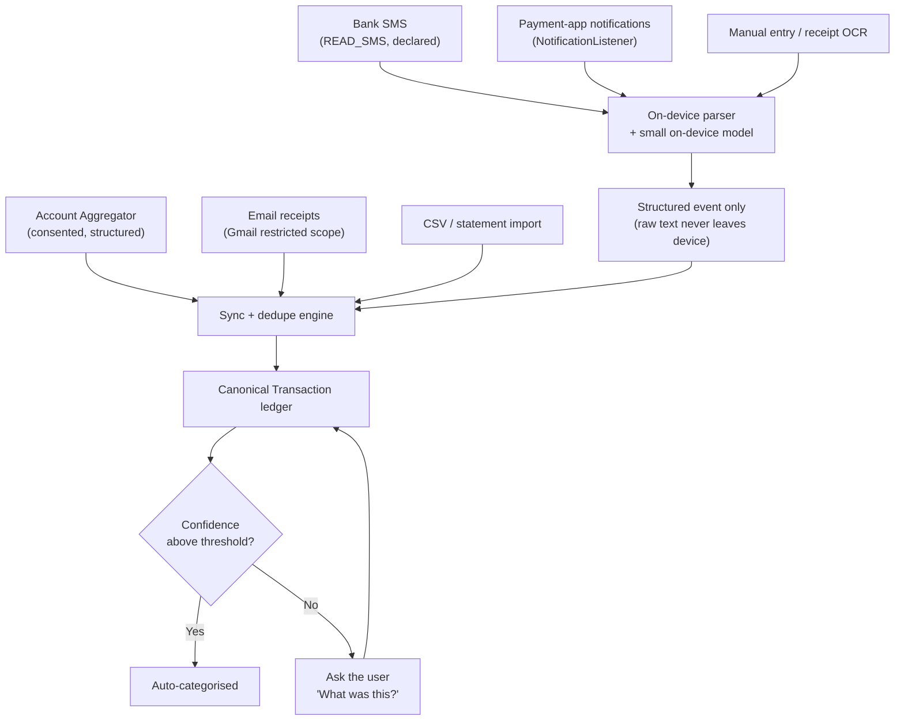

# PenniLogic — Data Ingestion Feasibility (Android)

> **Status:** Verified against primary sources on 2026-09-01.
> **Author:** Research phase, pre-implementation.
> **Why this document exists:** The entire product thesis is "every rupee you spend is tracked
> automatically." How we are *allowed* to observe spending determines the architecture, the
> compliance surface, and the go-to-market. This is the constraint document everything else
> hangs off. Read it first.

---

## 0. Executive summary

| Channel | Verdict | Confidence |
|---|---|---|
| **SMS transaction alerts** (`READ_SMS`) | ✅ **ALLOWED** — explicit Play exception for "SMS-based money management" | High — verified in current + upcoming policy |
| **Call logs** (`READ_CALL_LOG`) | ❌ **NOT ALLOWED** for our use case. Drop this requirement. | High — verified, no applicable exception |
| **Notification listener** | ⚠️ Allowed but policy-sensitive; use as *supplement*, not foundation | Medium — see §3 |
| **Email parsing** (Gmail restricted scopes) | ⚠️ Allowed but expensive (annual CASA security assessment) | Medium |
| **UPI app transaction history** | ❌ No public API. Not accessible to third parties. | High |
| **Account Aggregator (India)** | ✅ Strategic long-term channel; requires regulated-entity partnership | Medium — see §5 |
| **Manual entry / receipt scan** | ✅ Always available; the universal fallback | High |

**The single most important finding:** our exact use case is *named* in Google Play policy as a
permitted exception. That is a far better position than assumed. But it is explicitly a
**"temporary exception"** granted only where *"there's currently no alternative method to provide
the core functionality."* In India, Account Aggregator **is** becoming that alternative method.

> **Architectural mandate:** SMS is our wedge, not our foundation. Every ingestion channel must sit
> behind a common `TransactionSource` abstraction so that losing any one channel is a degradation,
> never an outage. Design for the day the SMS exception is narrowed.

---

## 1. SMS access — the core channel

### 1.1 What the policy actually says

Google Play restricts the `SMS` and `CALL_LOG` permission groups. Access requires the app to be the
default SMS/Phone/Assistant handler **or** to qualify for a listed *temporary exception*.

Two rows in the exception table apply to us:

| Use case (verbatim from policy) | Eligible permissions |
|---|---|
| **"SMS-based money management"** — *"For example, apps that track and manage budget"* | `READ_SMS`, `RECEIVE_MMS`, `RECEIVE_SMS`, `RECEIVE_WAP_PUSH` |
| **"SMS-based financial transactions"** — *"For example, Unified Payments Interface (UPI), verifications for financial transactions"* | `READ_SMS`, `RECEIVE_MMS`, `RECEIVE_SMS`, `RECEIVE_WAP_PUSH`, `SEND_SMS` |

Sources:
- Current policy: <https://support.google.com/googleplay/android-developer/answer/10208820>
- July 2026 policy preview (effective **2027-01-27**): <https://support.google.com/googleplay/android-developer/answer/17225965>

### 1.2 Durability check

I compared the current policy against the July 2026 preview line by line. **The "SMS-based money
management" row is present and textually unchanged in both.** The only removal in the 2027 revision
is *"account verification via phone call"* from `READ_CALL_LOG`, which does not affect us.

This matters: it means the exception is not on a published deprecation path. We are not building on
something Google has already announced it is taking away.

### 1.3 Conditions attached

1. **Core functionality test.** The permission must enable *"critical core functionality"* — the
   main purpose of the app, *"without which the app is broken or rendered unusable."*
2. **Store listing must promote it.** Policy: *"Make sure that your app's description prominently
   documents and promotes its core feature(s)."* → Our Play listing copy is a **compliance
   artifact**, not just marketing. It must lead with automatic SMS-based expense tracking.
3. **No alternative may exist.** The exception applies only where *"there's currently no alternative
   method to provide the core functionality."*
4. **Declaration required.** Must submit the Permissions Declaration Form in Play Console:
   <https://support.google.com/googleplay/android-developer/answer/9214102>
5. **Subject to review and approval** — the policy footnotes every exception row with this.
6. **Failure mode is severe.** *"Apps that fail to meet policy requirements or lack a Permissions
   Declaration Form may be removed from Google Play."*

### 1.4 Explicitly prohibited things we must never do

The policy lists disallowed uses. Directly relevant prohibitions:

- **"Any transfer that results in a sale of this data (including SDKs that sell this data)."**
  → Hard ban on monetising SMS-derived data. This also means we must audit every third-party SDK we
  ship for SMS access. No analytics SDK gets `READ_SMS`-adjacent data.
- "Research (like market research based on SMS)" → we cannot use SMS corpora for market research.
- "Social graph and personality profiling."

> **Design rule adopted:** raw SMS bodies are parsed **on-device** and never transmitted. Only the
> resulting structured transaction (amount, merchant, timestamp, account tail, direction) leaves the
> phone. This is simultaneously (a) a policy-risk reducer, (b) a DPDP/GDPR data-minimisation win,
> (c) a genuine marketing differentiator, and (d) it keeps raw message content out of any LLM
> prompt. See `docs/architecture/` for the on-device parsing design.

### 1.5 The Permissions Declaration Form — operational reality

Source: <https://support.google.com/googleplay/android-developer/answer/9214102>

**Process:**
1. Adding SMS permissions to the manifest triggers a Permissions Declaration Form alert in Play
   Console under App Content.
2. **A video demonstration is required** — showing a bank SMS arriving, the app detecting it, and
   the transaction appearing. This is the single most important artifact for approval.
3. Human review (not automated). Typical turnaround **7–14 days**; appeals 2–4 weeks. Budget 3–4
   weeks before treating the path as blocked.
4. Provide test credentials if the feature sits behind a login.

> ⚠️ **Operationally painful detail:** while an unresolved declaration alert is active, you **cannot
> publish any changes at all** — including store listing copy, screenshots, or pricing. This can
> freeze release operations at the worst possible moment.
>
> **Mitigation: file the declaration early, during beta**, not as a launch-week task.

**On rejection:** already-published versions keep working; only the update is blocked. You may
remove the permission and resubmit, appeal with more evidence, or fix and resubmit.

**Approval odds:** estimated high (~80–85%) *if* SMS parsing is the genuine core feature, the demo
video is clear, and the store listing prominently describes it — but this is an inference from
policy text and market evidence, not a published figure. `UNVERIFIED` as a number.

**Evidence others hold it:** ET Money, Walnut, Money View and CRED have historically shipped
SMS-based transaction detection in India and remain on the Play Store. This indicates Google does
grant this exception to Indian PFM apps. *(Whether each holds the grant today vs. having migrated to
notification listening is `UNVERIFIED`.)*

### 1.6 Residual risk and mitigation

| Risk | Impact | Mitigation |
|---|---|---|
| Play denies our declaration | Critical — kills auto-tracking at launch | Ship manual entry + notification listener from v1 so the app is functional without it. Prepare a rigorous declaration with demo video. |
| Play narrows the exception later (AA cited as "the alternative") | High | `TransactionSource` abstraction; invest in AA integration before we are forced to. |
| Re-review on a future update revokes the grant | High — blocks updates | Keep declaration evidence current; never expand SMS use beyond what was declared. |
| A shipped third-party SDK touches SMS data | Critical — policy violation + trust loss | SDK allowlist, dependency review in CI, no ad SDKs in the app. |

---

## 2. Call logs — drop this requirement

**The original brief asked for call access. This is not achievable and should be removed from scope.**

The `CALL_LOG` group is available only for: default Phone handler, caller ID/spam detection,
connected-device companion apps, cross-device sync, device automation, enterprise CRM/MDM, in-vehicle
use, proxy calls, *"call-based authentication and authorization in banking or brokerage apps"*
(i.e. a bank's own app, not a third-party PFM), and writing history in a default dialer.

There is **no money-management exception for call logs**, and *"account verification via phone call"*
is being removed effective **2027-01-27**.

**Recommendation:** cut it. There is also no real product value here — call logs tell you *who* you
called, not what you spent. The plausible underlying intents (detecting collections calls from
lenders, logging a call with your bank) are better served by other means, and none justify the
review risk of requesting a permission group we cannot qualify for. Requesting it would likely
jeopardise the SMS declaration in the same review.

---

## 3. Notification listener — co-primary, and rising in importance

`NotificationListenerService` reads posted notifications, including payment-app notifications that
have no SMS equivalent (in-app UPI confirmations, wallet debits).

> ⚠️ **Trend correction (from competitive research, 2026-09).** SMS parsing in India is
> **declining as a channel**: UPI apps are increasingly silent on SMS, and banks are shifting from
> SMS alerts to their own app push notifications. This means the notification listener is not a
> nice-to-have supplement — it is becoming **co-primary with SMS**, and on some banks it is already
> the *only* channel.
>
> **Implication:** build the notification listener in the same phase as SMS, not later. An
> SMS-only ingestion strategy is aimed at a shrinking channel.

**Verified policy position (as of 2026-09):**
- `BIND_NOTIFICATION_LISTENER_SERVICE` does **not** require a Play Permissions Declaration Form.
  *(Marked `UNVERIFIED` as to whether Google has changed this recently — re-confirm before relying
  on it.)*
- The grant is always a manual trip to **Settings → Special App Access → Notification Access**.
  There is no runtime permission dialog, on any Android version. This is a real onboarding
  drop-off point and must be designed with care.
- **Android 12+ "restricted settings"** shows a blocking warning for apps installed *outside* the
  Play Store. **Play-installed apps are unaffected** — but this does complicate sideloaded QA and
  beta distribution, so test both paths.
- **Android 13+:** `POST_NOTIFICATIONS` (posting) is a separate, unrelated permission from
  `NotificationListenerService` (reading). We likely need both.
- **Android 14/15/16:** no new restrictions for Play Store apps; grant mechanism unchanged.

Source: <https://developer.android.com/reference/android/service/notification/NotificationListenerService>

Remaining caveats to design around:
- Notification content is unstructured, locale-dependent, and changes whenever a payment app ships
  a redesign. Parsers **will** silently rot.
- Must be justified in the Data Safety form and privacy policy.

> **Design rule:** notification-derived transactions are **lower-confidence** than SMS-derived ones.
> They feed the same dedupe/confidence pipeline but should more readily trigger the
> "we're not sure what this was — can you confirm?" user prompt. Never let a notification-parsed
> record silently overwrite a bank-SMS-parsed record.
>
> Apply the **same on-device parsing rule**: raw notification text is parsed locally; only the
> structured transaction is transmitted.

---

## 4. UPI apps — no direct access

There is **no public API** to read transaction history from Google Pay, PhonePe, Paytm, or BHIM.
Third-party apps cannot enumerate another payment app's transactions.

What *is* available:
- The `upi://pay` deep-link/intent spec, for *initiating* a payment. The initiating app receives a
  response for **that transaction only** — useful if the user pays *through* PenniLogic, not for
  observing payments made elsewhere.
- Becoming an NPCI **TPAP** (Third Party Application Provider) requires PSP-bank sponsorship and is
  a substantial regulatory undertaking — a company-defining strategic move, not a feature.

**Conclusion:** UPI spending is observed **indirectly**, via the bank's debit SMS and via payment-app
notifications. This is exactly why §1 and §3 matter so much in the Indian market. The original
brief's hope of "accessing other UPI apps" directly is not achievable; the outcome it wants
(seeing UPI spend) *is* achievable through those two channels.

---

## 5. Account Aggregator — the strategic endgame (India)

India's RBI-regulated Account Aggregator framework provides **consented, structured, machine-readable
financial data** directly from banks. It is strictly superior to SMS scraping: authoritative amounts
and balances, no parser rot, no permission risk, full history rather than only messages that happen
to still be on the device.

**Scale as of March 2026:** 284.6M linked accounts, 179+ FIPs, ~1,000 FIUs. Personal Finance
Management is an explicitly recognised consent purpose. Transaction granularity is rich — date,
amount, credit/debit, narration, mode (NEFT/UPI/IMPS), and counterparty where available — with up to
6 months of deposit transaction history.

### 5.1 ⚠️ The eligibility blocker

**A non-regulated fintech cannot become a Financial Information User (FIU) directly.** Per RBI's AA
Master Direction, as published by Sahamati:

> *"Entities who want to become FIUs need to be registered and regulated by at least any one of the
> Financial Service Regulators (FSR), namely — RBI, SEBI, IRDAI, PFRDA."*
> — <https://sahamati.org.in/fiu/>

**PenniLogic as-is is NOT eligible.** Critically, a Technology Service Provider (Setu, Perfios,
Finarkein, FinBox…) **cannot grant FIU status** — a TSP builds the technology, but the legal FIU
entity must still be regulated.

| Route | What it means | Assessment |
|---|---|---|
| **A. Partner with a regulated FIU** | A bank/NBFC/SEBI-IA pulls the data; we receive it under a data-sharing agreement | Viable; widely used. Adds a dependency and a revenue share |
| **B. TSP** | Speeds up integration — but only *for* a regulated entity | **Does not solve eligibility** |
| **C. Become regulated** | SEBI IA registration (lower barrier than NBFC's ~₹10 Cr) | **Strategically cleanest** — see below |
| **D. Stay on SMS/on-device for MVP** | AA framework doesn't govern on-device parsing at all | **Correct for MVP** |

### 5.2 The strategic insight: SEBI IA registration solves two problems at once

SEBI Investment Adviser registration would simultaneously:
1. Make PenniLogic **eligible for FIU status**, unlocking AA directly; and
2. **Legitimise richer financial advice features** that we must otherwise carefully avoid.

That dual payoff makes it the cleanest long-term path, and it should be evaluated as a deliberate
strategic decision rather than a compliance afterthought.

### 5.3 What this does to our risk profile

> ⚠️ **This is the most important consequence of this research.** I previously treated AA as a
> straightforward fallback if the SMS exception were withdrawn. **It is not.** We cannot simply
> "switch to AA" — doing so requires either a regulated partner or our own registration, each of
> which takes months to years.
>
> **Therefore the SMS/notification channel is a harder dependency than it first appeared**, and the
> mitigation is *not* "we'll move to AA if needed." The real mitigations are: (a) make manual entry
> and import genuinely excellent so the product survives without automation, (b) build the
> notification channel in parallel since it is not governed by the SMS policy, and (c) begin the
> regulated-partner or SEBI-IA conversation **early**, treating it as long-lead-time work.

**Counsel flag:** confirm current FIU eligibility criteria directly against the RBI Master Direction
with a legal adviser. The above reflects Sahamati's published guidance as of 2025–26.

---

## 5.5 On-device parsing — how the "raw text never leaves" rule is actually implemented

This is the mechanism that makes the privacy promise real rather than marketing.

**Two-tier parser, deliberately ordered:**

| Tier | Mechanism | Coverage | Device requirement |
|---|---|---|---|
| **Primary** | Deterministic regex/template parser over known bank SMS formats | ~80–85% of Indian bank messages | **Any device** |
| **Fallback** | Small on-device LLM (Gemma-3 1B, 4-bit, ~0.6 GB, via LiteRT-LM) for unrecognised formats | Long tail | Snapdragon 8 Gen 2+ / 8 GB+ RAM |

> ⚠️ **Important correction to the AI research recommendation.** That report proposed the on-device
> LLM as *primary* with regex as fallback. **We invert that.** The LLM needs a flagship device
> (Pixel 8+, Galaxy S23+, 8 GB+ RAM). In India — our launch market — a large share of users are on
> mid- and low-range hardware. An architecture whose core ingestion path only works on premium
> phones would fail most of the target market.
>
> **Therefore: the deterministic parser is the primary path and must work on every device.** The
> on-device model is an enhancement for the long tail on capable hardware. This also makes parsing
> fast, battery-cheap, and debuggable.

### ✅ Empirically validated (2026-09-01)

The deterministic approach was tested end-to-end rather than assumed:

1. Booted an **Android 12 (API 31)** emulator.
2. Injected three realistic Indian bank SMS via `adb emu sms send` with authentic sender IDs
   (`VM-HDFCBK`, `AD-ICICIB`, `JD-SBIINB`), confirming they land in the device inbox.
3. Ran a regex parser against those exact formats.

**Result: 5/5 passed** — see [`spikes/sms_parser_spike.py`](spikes/sms_parser_spike.py).

| Case | Outcome |
|---|---|
| HDFC UPI debit → SWIGGY | ✅ `DEBIT 1,250.00 INR, a/c 4523, 2026-09-01` |
| ICICI card spend → UBER INDIA | ✅ `DEBIT 450.00 INR, a/c 8891` |
| SBI salary credit | ✅ `CREDIT 85,000.00 INR, a/c 7734` |
| Loan promo from a *bank* sender | ✅ correctly ignored (no false positive) |
| Non-bank sender with a rupee amount | ✅ correctly ignored |

The two negative cases matter as much as the positive ones: a parser that hallucinates transactions
from promotional messages would corrupt the ledger and destroy trust faster than one that misses
messages.

**Design rules confirmed by the spike:**
- Amounts parse to **integer minor units** via string arithmetic, never `float(x) * 100`.
  Verified: `0.10 + 0.20 == 0.30` exactly.
- The output type has **no raw-text field**, making ADR-004 structurally enforced rather than a
  convention.
- Unparsed messages **fail closed** (return `None`) and route to the "what was this?" clarification
  flow. A wrong number is far worse than an absent one.

**Rules:**
- Only the structured result leaves the device:
  `{ amount, merchant, direction, occurred_at, account_ref }`
- Store a **hash** of the raw message for deduplication — never the message text itself.
- The server neither stores nor processes raw SMS bodies. This is enforced by the API contract:
  there is no field in which raw message text could be sent.
- Parser templates ship as **remotely updatable configuration**, so a bank changing its SMS format
  is a config push, not an app release (see risk R6 in the risk register).

---

## 6. Recommended ingestion architecture

Ranked by data quality. All channels normalise into one `RawFinancialEvent` → dedupe → enrich →
`Transaction` pipeline.

**Priority order for build:**

1. **Manual entry + import** — must exist first. Guarantees the app works for *everyone*, including
   users who deny every permission and markets where SMS alerts aren't a norm. Never let the app be
   useless without a permission grant.
2. **SMS parsing (on-device)** *and* **notification listener** — build these **together**, in the
   same phase. SMS alone targets a declining channel (see §3); notifications alone miss banks that
   still prefer SMS. Together they approximate full coverage.
3. **Account Aggregator** — the durable moat; start partner conversations early.
4. **Email parsing** — later. The Gmail restricted-scope CASA assessment is an annual recurring cost
   and should be justified by demonstrated demand.

### 6.1 Market validation

Competitive research confirms SMS parsing is **the dominant legacy approach in India**, not an
unusual one — used by Walnut (historically), MoneyView, ET Money and others. Meanwhile
Account Aggregator is the clear future standard, with **38+ major banks live as of 2025–26** and
adoption by Fi Money, Jupiter, INDmoney, CRED, Groww and smallcase.

This validates the strategy: **SMS + notifications is the correct MVP ingestion approach, and AA is
the correct Year 1–2 roadmap item.** We are not doing something unusual, and we are not building on
a channel with no successor.

---

## 7. Open questions

- [x] ~~Play policy text governing `NotificationListenerService`~~ — resolved in §3; no declaration
      form required (re-confirm before launch)
- [x] ~~Evidence of finance apps holding the SMS grant, approval timelines~~ — resolved in §1.5
- [ ] Can a non-regulated startup access AA data via a TSP, or is a regulated partner mandatory?
      *(in progress — see `docs/compliance/`)*
- [ ] Gmail restricted-scope CASA tier and current cost
- [x] ~~Does requesting `QUERY_ALL_PACKAGES` create review risk?~~ — resolved: do not request it.
      Declare only the specific package interactions required under manifest `<queries>`. Invitations use
      Android Contact Picker or manual entry rather than `READ_CONTACTS`; `T-CMP-05` enforces both rules.
- [x] ~~Real-world parse coverage of the deterministic parser~~ — **validated 5/5 on an API 31
      emulator** against realistic HDFC/ICICI/SBI formats, including correct rejection of
      promotional and non-bank messages (see §5.5). The broader 80–85% corpus coverage figure still
      needs validating against real messages on a physical device with an Indian SIM.

---

## 8. Sources

| Claim | Source |
|---|---|
| SMS/Call Log permission policy, exception table | <https://support.google.com/googleplay/android-developer/answer/10208820> |
| July 2026 policy preview, effective 2027-01-27 | <https://support.google.com/googleplay/android-developer/answer/17225965> |
| Permissions Declaration Form | <https://support.google.com/googleplay/android-developer/answer/9214102> |
| AA supports PFM use case | <https://sahamati.org.in/> |
